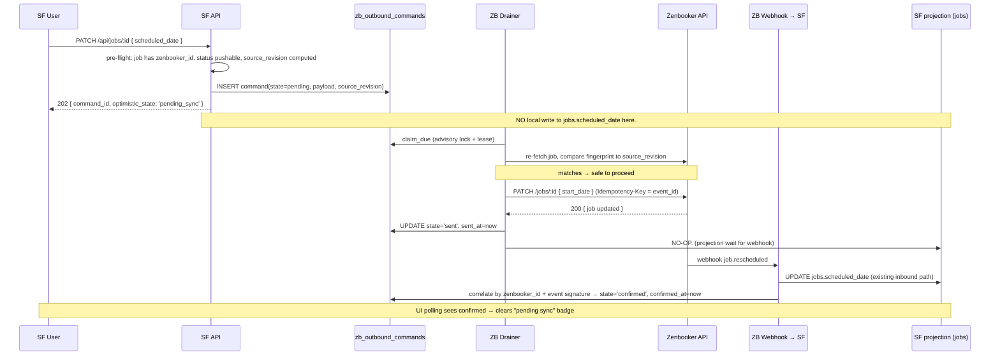
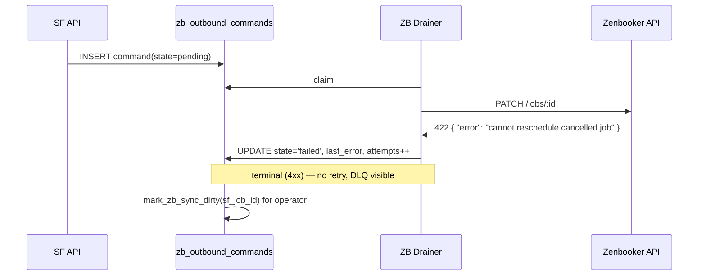
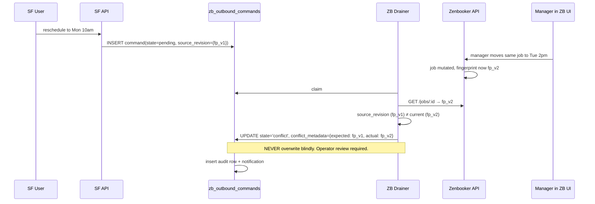
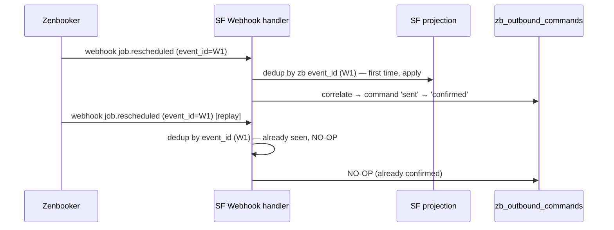

# SF → ZB Outbound: Command / Confirmation Architecture

**Status:** Design proposal — not ratified, not implemented.
**Scope:** ServiceFlow → Zenbooker outbound writes (job create, reschedule, assign, cancel, minimal customer push).
**Governed by:** [synchronization-constitution.md](./synchronization-constitution.md). Where this design conflicts with the constitution, the constitution wins.
**Companion to:** existing LB outbound drainer (`workers/leadbridge-outbound-drainer.js`, `services/lb-outbound-delivery.js`) — re-uses the same durability primitives.

This document specifies the architecture only. It does not create migrations, schemas, code, or production changes. Implementation is gated on §10 rollout.

Language: **MUST**, **MUST NOT**, **SHOULD**, **MAY** follow RFC 2119.

---

## 0. Architectural premise (one paragraph)

ServiceFlow owns **business intent**. Zenbooker owns **execution confirmation** for ZB-managed fields during the hybrid operating period. SF never blindly double-writes a ZB-owned field. Instead, SF persists an **outbound command** describing the intended mutation, a drainer POSTs that command to ZB's API, and the system waits for ZB's webhook (or reconcile sweep) to **echo the new state back** before declaring the command "confirmed." The local projection is updated only when the echo arrives. This preserves the constitution's single-writer guarantee (§1, §2): for any ZB-owned field, the **only** writer is the ZB inbound handler — the outbound path emits intent but never writes the field itself.

---

## 1. Ownership model

### 1.A Business ownership

ServiceFlow is the long-term system of record. Every entity — even those whose **execution** lives in ZB today — has a row in SF that participates in CRM, payroll, ledger, communications, and reporting. SF is the only system the operator uses to reason about historical truth.

### 1.B Execution ownership

While managers continue working primarily in Zenbooker, ZB remains the **canonical execution owner** for ZB-managed operational fields (scheduling, assignment, invoice, payment). All mutations to those fields — whether initiated by a manager in ZB or by a user in SF — funnel through ZB's API and are confirmed by ZB's event stream.

### 1.C Projection model

SF persists projections of ZB-owned fields. The outbound command queue is **not** a writer to those fields. The flow is:

```
SF action → outbound command (intent) → ZB API → ZB applies → ZB webhook → SF inbound handler writes the projection
```

The outbound drainer **MUST NOT** write to `jobs.status`, `jobs.scheduled_date`, `job_team_assignments`, etc. directly. Those writes belong to the inbound webhook handler and reconcile path, which are unchanged.

### 1.D Future migration path

The hybrid period ends when both conditions hold:
1. Managers operate primarily in SF (Zenbooker as a viewing-only mirror or a downstream notification sink).
2. ZB outbound has reached "broader convergence" (Phase E in §10) — meaning every operational mutation initiated in SF reliably propagates to ZB and re-converges, with no manual drift repair in the last 30 days.

At that point:
- Execution ownership shifts to SF for ZB-managed fields.
- ZB becomes a **sync target** — SF emits authoritative events, ZB consumes them.
- The inbound webhook handler degrades to a *reconciliation cross-check* rather than the canonical writer.
- The constitution is amended (§1.1 ownership matrix) to reflect the swap; the outbound queue gains permission to write SF projections directly because SF is now canonical.

This migration is a separate ratification, not part of the current design.

### 1.E Field-level ownership matrix (hybrid period)

For each field: **Business owner** (where intent originates and historical truth lives), **Execution owner** (which system's API is the canonical mutator today), and **Outbound pushable?** (whether SF MAY emit an outbound command to mutate this field in ZB).

| Field / entity | Business owner | Execution owner | Outbound pushable? | Notes |
|---|---|---|---|---|
| `jobs.status` (lifecycle transitions) | SF | ZB | **Cancel: yes (Phase 1).** Reschedule: yes (Phase 1). Started/Completed: NO. | SF MUST NOT push completion — that's ZB-driven via cleaner's mobile actions. Cancel reaches ZB via `job.cancel` command. |
| `jobs.scheduled_date`, `start_date` | SF (intent) | ZB | **Yes — Phase 1** (via `job.reschedule`). | New scheduled date is intent; ZB confirms by webhook. |
| `jobs.start_time`, `end_time` (actuals) | ZB | ZB | NO. | Actual lifecycle timestamps come from the cleaner. SF projects only. |
| `assigned_providers[]` / `job_team_assignments` | SF (intent) | ZB | **Yes — Phase 1** (via `job.assign_providers`). | Mapping prerequisite: every assigned member MUST have `team_members.zenbooker_id`. Unmapped → command fails terminal. |
| `jobs.service_price`, `total`, `discount`, `additional_fees`, `taxes`, `invoice_*`, `payment_status`, `payment_method` | ZB | ZB | NO (Phase 1). | Price mutations originate from ZB invoice flow. SF MUST NOT push price changes back. Future: separate Stripe-driven path. |
| `jobs.duration` (estimated) | ZB | ZB | NO. | Comes from service template in ZB. Out-of-scope for Phase 1. |
| `jobs.tip_amount` | ZB (Stripe/manual entry in ZB) | ZB | NO. | Already has special preserve rule in inbound (constitution §4.4). |
| `jobs.notes` (customer-facing) | Contested | ZB | NO (Phase 1). | Phase 1 keeps SF notes SF-only. Push-back is Phase E+ once an authority is chosen. |
| `jobs.hours_worked` | SF | SF | NO. | SF-canonical per constitution §1.1. ZB has no schema for it. |
| `jobs.incentive_amount`, `cleaner_salary_override` | SF | SF | NO. | Same. |
| `jobs.cancellation_*` (fee, notes, reason, cancelled_at/by) | SF | SF | NO (the *fact* of cancellation pushes; the SF-side metadata stays SF-side). | `job.cancel` command carries a reason string but SF retains the structured cancellation record. |
| `customers` row identity | SF | SF | **Minimal — Phase 1.** | Only on `job.create` when SF needs a ZB customer ID to attach. Push is name + phone + email + address; ZB stamps `zenbooker_id` on response and SF stores it. No standalone customer-edit pushes in Phase 1. |
| `customers.phone`/`email`/`address` (existing customer) | SF | SF | NO (Phase 1). | Already-linked customers do not receive update pushes. ZB→SF fill-blanks adoption stays the only sync direction. |
| Payroll rows / `cleaner_ledger` | SF | SF | NO (forever). | Constitution §3.1 immutability bars external mutation. |
| `transactions` | ZB | ZB | NO. | Future Stripe path handles refunds; ZB transaction sync is unchanged. |
| `team_members` row identity | SF | SF | **Out-of-scope Phase 1.** | New cleaners created in SF cannot yet be auto-pushed to ZB (Phase E+ candidate). Prerequisite for Phase 1 outbound: cleaner already exists in ZB and `zenbooker_id` is set. |
| `team_members.hourly_rate`, `commission_pct` | SF | SF | NO. | Payroll-shaped fields. Constitution §3.5 — SF-only. |
| Internal notes / SF metadata (tags, custom fields) | SF | SF | NO. | SF-only forever. |
| Communication state (conversations, messages, calls) | SF (linkage), Sigcore (transport) | Sigcore | N/A. | Different domain — handled by Sigcore boundary (constitution §7.1). Out of scope. |

**Rule:** A field is outbound-pushable only if (a) ZB has a schema slot for it AND (b) SF is the legitimate origin of the intent AND (c) the field is not constitutionally immutable. Anything not in the "Yes — Phase 1" column **MUST NOT** generate an outbound command.

---

## 2. Command / confirmation architecture

### 2.1 The two-phase model

A command moves through two phases. **Both must succeed** before SF declares state convergence.

```
Phase 1 — DELIVERY                Phase 2 — CONFIRMATION
─────────────────────────────     ───────────────────────────────────
SF UI emits intent         →      ZB delivers webhook for the change
Outbound command persisted        OR reconcile sees the new state
Drainer claims + POSTs ZB         SF inbound handler updates projection
ZB returns 2xx                    Drainer correlates: command.confirmed_at
Command.sent_at populated         Drainer: state='confirmed'
                                  (or 'conflict' if webhook differs)
```

**Phase 1 ("sent") ≠ Phase 2 ("confirmed").** A command in `sent` state means ZB accepted the API call; it does **not** mean SF's projection reflects the change. Only when the inbound webhook (or reconcile sweep) echoes the intended state does the command transition to `confirmed`.

This separation is the entire reason for the architecture. Without it, an optimistic local write could diverge from ZB's actual state and the constitution's single-writer guarantee is broken.

### 2.2 Command lifecycle states

| State | Meaning | Next states |
|---|---|---|
| `pending` | Persisted, awaiting drainer claim. | `sending`, `cancelled` |
| `sending` | Claimed by a drainer worker (lease held). | `pending` (lease expired), `sent`, `failed`, `conflict` |
| `sent` | ZB returned 2xx; awaiting confirmation echo. | `confirmed`, `confirm_timeout`, `conflict` |
| `confirmed` | Matching inbound webhook (or reconcile) verified the new ZB state matches intent. **Terminal.** | — |
| `failed` | Retryable error budget exhausted, or hard 4xx. **Terminal (DLQ).** | (manual: `pending` after operator fix) |
| `conflict` | A pre-flight re-fetch found ZB state had diverged from `source_revision` since the command was created, OR the confirmation echo shows a state different from intent. **Terminal until resolved.** | (manual: `cancelled` or fresh command) |
| `confirm_timeout` | Sent successfully, but no echo arrived within `confirmation_deadline`. **Operator-visible; reconcile sweep may auto-resolve.** | `confirmed` (reconcile catches up), `conflict` |
| `cancelled` | Caller cancelled before send, or operator dismissed a stuck command. **Terminal.** | — |
| `skipped_precondition` | Failed a precondition before send (unmapped provider, missing zenbooker_id, kill switch off). **Terminal.** | — |
| `cancelled_superseded` | Replaced by a newer canonical-intent command in the same field-group (§6.8). The old mutation may or may not have reached ZB; `zb_response` records the snapshot at supersession. **Terminal.** | — |
| `invalidated_by_upstream_terminal_state` | ZB job entered a terminal state (cancelled, completed, invoiced, archived) that makes the intent unrealizable (§6.10). **Terminal.** No automatic retry. | (manual: operator may issue a fresh command if the job is re-opened) |
| `ambiguous_pending_review` | Echo received but correlation confidence is `ambiguous` (§3.5.1). Awaiting operator decision. | `confirmed`, `conflict`, `cancelled_superseded` |

### 2.3 Sequence diagrams

#### Successful command — reschedule



#### Failed command — ZB returns 4xx



#### Conflicting manager edit in ZB



#### Duplicate webhook replay (after a `sent` command)



### 2.4 Confirmation deadline + reconcile fallback

Every command has a `confirmation_deadline` (e.g., `sent_at + 10 minutes`). If no echo arrives by then:
- Drainer transitions the command to `confirm_timeout`.
- The next ZB reconcile cycle (existing path) is the safety net: it pulls the latest job from ZB and compares to SF. If they now match the command's intent, the timeout-monitor MAY auto-promote the command to `confirmed`.
- If reconcile shows ZB state still doesn't match intent after the timeout, the command transitions to `conflict` and is surfaced to the operator.

The reconcile cycle is **not** a new system — it's the existing `runPaymentReconcile` / `/reconcile-job/:jobId` paths, extended with one new responsibility: cross-check open commands against current ZB state.

### 2.5 Reconcile invariant (convergence-only)

**Invariant:** Reconcile MAY confirm or invalidate commands, but MUST NOT generate new outbound commands. Reconcile is a convergence mechanism, not an intent producer.

Concretely:
- Reconcile MAY transition `sent` / `confirm_timeout` → `confirmed` when ZB state matches a known command's `intent_hash` exactly.
- Reconcile MAY transition `sent` / `confirm_timeout` → `conflict` when ZB state diverges from intent and the job is still mutable.
- Reconcile MAY transition any open command → `invalidated_by_upstream_terminal_state` when ZB's reading shows a §6.10 trigger (job completed, cancelled, invoiced, archived).
- Reconcile MUST NOT `INSERT` into `zb_outbound_commands`. Origin `'reconcile'` (§3.7) is reserved as an alert signal — a non-zero count is a §2.5 breach and pages on-call.
- Reconcile MUST NOT silently flip `conflict` → `confirmed`. Auto-resolution from a conflict is permitted **only** when the live observed state hashes exactly to `intent_hash` and no operator action has touched the row in between — and even then it MUST log the auto-resolution to `webhook_delivery_log` with `note='reconcile_auto_resolved_conflict'`.
- Reconcile MUST NOT mutate `payload_json`, `source_revision`, `intent_hash`, `field_group`, `origin`, or `requested_by_*`. Those originated from the producer and are immutable for the row's lifetime.

Rationale: reconcile is observed-state-only. The producer side of the system is the sole writer of intent. Mixing the two creates a feedback loop where reconcile could "fix" a perceived gap by synthesizing intent no user requested — a violation of constitution §0 P2 (loud failures) and the single-owner-of-intent principle. If reconcile finds an SF-side projection it cannot explain via a known command, it MUST log a `reconcile_orphan_state` audit row and surface to the operator. It MUST NOT manufacture a command to "close the gap."

---

## 3. Outbound command queue design

### 3.1 Schema proposal — `zb_outbound_commands`

```sql
CREATE TABLE zb_outbound_commands (
  -- identity
  id                     UUID PRIMARY KEY DEFAULT gen_random_uuid(),
  event_id               TEXT NOT NULL UNIQUE,         -- uuidv7. Sent as Idempotency-Key header IF Q1 resolves to "supported" (currently assumed unsupported — primary retry-safety lives in §3.6.1 pre-flight check). Always required as a stable internal correlation id regardless of Q1 outcome.
  user_id                BIGINT NOT NULL,              -- tenant scope (constitution §6.10)

  -- target
  command_type           TEXT NOT NULL,                -- 'job.create' | 'job.reschedule' | 'job.assign_providers' | 'job.cancel' | 'customer.upsert'
  sf_job_id              BIGINT,                       -- nullable for customer.upsert
  sf_customer_id         BIGINT,                       -- nullable
  zenbooker_id           TEXT,                         -- target ZB resource id (job or customer); nullable for create-shaped commands

  -- payload + intent fingerprint
  payload_json           JSONB NOT NULL,               -- frozen at insert
  source_revision        JSONB NOT NULL,               -- pre-flight fingerprint of ZB state we believe we are mutating
  intent_hash            TEXT NOT NULL,                -- hash(payload_json) for echo correlation

  -- lifecycle state
  state                  TEXT NOT NULL DEFAULT 'pending',  -- §2.2 states
  attempts               INT  NOT NULL DEFAULT 0,
  next_attempt_at        TIMESTAMPTZ,
  claimed_by             TEXT,
  claimed_until          TIMESTAMPTZ,

  -- timestamps
  requested_at           TIMESTAMPTZ NOT NULL DEFAULT now(),
  last_attempt_at        TIMESTAMPTZ,
  sent_at                TIMESTAMPTZ,
  confirmed_at           TIMESTAMPTZ,
  terminal_at            TIMESTAMPTZ,                  -- failed | cancelled | skipped_precondition
  confirmation_deadline  TIMESTAMPTZ,                  -- sent_at + grace, nullable until sent

  -- audit
  requested_by_user_id   BIGINT NOT NULL,              -- the SF user/team_member who initiated
  requested_by_actor     JSONB NOT NULL,               -- { type, id, display_name }

  -- diagnostics
  last_error             TEXT,
  conflict_metadata      JSONB,                        -- { expected_revision, observed_revision, diff }
  zb_response            JSONB,                        -- last response from ZB API (body trimmed)
  zb_event_id            TEXT,                         -- the inbound webhook event_id that confirmed this command
  defer_reason           TEXT,                         -- e.g. 'zb_disconnected', 'unmapped_provider'

  -- supersession / coordination (§6.8–§6.10)
  field_group            TEXT NOT NULL,                -- 'schedule' | 'assignment' | 'lifecycle' | 'create' | 'customer'
  superseded_by_command_id UUID,                       -- pointer to the command that replaced this one
  supersedes_command_id    UUID,                       -- back-pointer to the command this one replaced
  invalidation_reason    TEXT,                         -- populated when state='invalidated_by_upstream_terminal_state'

  -- correlation + provenance
  correlation_confidence TEXT,                         -- 'exact' | 'probable' | 'ambiguous' | NULL until correlated (§3.5.1)
  origin                 TEXT NOT NULL DEFAULT 'user'  -- 'user' | 'automation' | 'api' | 'reconcile' | 'migration' (§3.7)
);

CREATE INDEX idx_zb_outbound_due
  ON zb_outbound_commands (state, next_attempt_at)
  WHERE state IN ('pending', 'sending');

CREATE INDEX idx_zb_outbound_open_by_zb_id
  ON zb_outbound_commands (zenbooker_id, state)
  WHERE state IN ('sent', 'confirm_timeout', 'ambiguous_pending_review');  -- correlation lookup target

CREATE INDEX idx_zb_outbound_user
  ON zb_outbound_commands (user_id, state, requested_at DESC);

CREATE INDEX idx_zb_outbound_field_group_open
  ON zb_outbound_commands (user_id, sf_job_id, field_group, state)
  WHERE state IN ('pending', 'sending', 'sent');  -- §6.8 supersession lookup
```

Notes:
- `event_id` is uuidv7 (already used by LB outbound). Used as ZB `Idempotency-Key` so a retried POST after a network timeout doesn't double-execute.
- `intent_hash` is a deterministic hash of the *normalized* intent (canonicalized JSON of the fields that should be observable in the echo). Used to verify the echo matches.
- `source_revision` is the *pre-flight* fingerprint of the relevant ZB job fields. The drainer re-fetches before send and bails to `conflict` if it has changed.
- No FK to `jobs` — we want commands to outlive a deleted job for audit.

### 3.2 Lease + dedup primitives (re-used from LB)

Three RPCs MUST be created, mirroring [migration 022's LB outbound functions](../../workers/leadbridge-outbound-drainer.js):

- `zb_outbound_try_tick_lock()` — advisory lock per drainer tick (one drainer leader per replica).
- `zb_outbound_sweep_stale_leases()` — returns rows from `sending` whose `claimed_until` passed back to `pending`.
- `zb_outbound_claim_due(p_worker text, p_lease_s int, p_limit int)` — `FOR UPDATE SKIP LOCKED`-based atomic claim.

Dedup at the application boundary:
- Caller passes an `idempotency_key` derived from `(user_id, command_type, sf_job_id, intent_hash)` plus a coarse time bucket. Two identical reschedules of the same job within the bucket window collapse to one row.
- `event_id` is generated *inside* the insert helper, so two duplicate inserts both produce DB-UNIQUE-violation on the dedup key — caller treats that as success (returns existing command row).

### 3.3 Retry schedule

Same shape as LB drainer, two budget categories:

**Network / 5xx / 429 retries** (transient): `0s, 10s, 60s, 10m, 1h` — cap at 5 attempts, then `failed` (DLQ).

**Precondition defers** (e.g., `zb_disconnected`, `unmapped_provider`, kill switch off): `1h, 2h, 3h, 4h` cap — up to 48 defers (~ZB outage tolerance ≈ several days), then `failed`. Defer leaves the row in `pending` with `defer_reason` populated so the operator can see *why* it's idle.

**Hard 4xx** (400 / 401 / 404 / 422): no retry. `failed` immediately, `last_error` captured. ZB confirms many class-level errors via 422 — those go straight to DLQ for operator inspection.

**Stale-lease sweep:** any `sending` row whose `claimed_until < now()` returns to `pending`. Same as LB.

### 3.4 Dead-letter behavior

A row in `failed` state:
- MUST emit an audit row to `webhook_delivery_log` (the table proposed by constitution §9 P1.6) with `direction='outbound_zb'`, `terminal_reason`, and the trimmed response.
- MUST mark `zb_sync_dirty` for the linked `sf_job_id` (extending the existing dirty-marker system — constitution §9 P1.2).
- MUST be visible at `GET /api/zenbooker/outbound/dlq` (operator endpoint).
- MAY be re-armed by an operator endpoint (`POST /api/zenbooker/outbound/:id/retry`) which resets `state='pending'`, `attempts=0`, `next_attempt_at=now()`.

### 3.5 Webhook correlation strategy

When an inbound ZB webhook fires for a job, the inbound handler MUST run a correlation step after its normal projection work:

```
For each open command (state IN ('sent','confirm_timeout')) with zenbooker_id = <webhook job id>:
  if event_kind matches command_type's expected echo (e.g. job.rescheduled echoes job.reschedule):
    if compute_intent_hash(echo) == command.intent_hash:
      UPDATE command SET state='confirmed', confirmed_at=now(), zb_event_id=<inbound event_id>
    else:
      UPDATE command SET state='conflict', conflict_metadata={expected_hash, observed_hash, diff}
```

Correlation MUST happen **after** the inbound dedup check, so a replayed webhook (already-applied) doesn't flap a command from `confirmed` back to anything.

`expected echo` is a per-command-type lookup table:
- `job.reschedule` → `job.rescheduled` OR `job.service_order.edited` with `start_date` changed
- `job.assign_providers` → `job.service_providers.assigned` (echo carries the new provider set)
- `job.cancel` → `job.canceled`
- `job.create` → `job.created` (ZB-generated event after our POST)
- `customer.upsert` → `customer.edited` OR the create response (synchronous — see §4.5)

### 3.5.1 Correlation confidence levels

ZB's webhook ecosystem may not be deterministic per command type — a `PATCH /v1/jobs/:id` may emit `job.service_order.edited` regardless of which fields changed, or it may emit multiple events. The correlation step MUST therefore produce a *confidence verdict*, not a binary match.

| Verdict | Definition | Allowed action |
|---|---|---|
| `exact` | (a) Echo event type is in the command's preferred-echo set AND (b) the echo body's normalized field projection hashes to `intent_hash`. | Auto-confirm. Set `state='confirmed'`, `correlation_confidence='exact'`. |
| `probable` | (a) Echo event type is a generic edited-style event (not in the preferred set), AND (b) the `changed_fields` subset (diff between `source_revision` and echo body) is a strict subset of the command's intended fields, AND (c) exactly one open command for this `zenbooker_id` claims any of those fields. | Auto-confirm with audit. Set `state='confirmed'`, `correlation_confidence='probable'`. Write `webhook_delivery_log.confidence='probable'` for retrospective review and sampling. |
| `ambiguous` | Multiple open commands could plausibly match, OR the changed-field subset overlaps but does not match a single command, OR the echo arrived outside the expected timestamp window (`sent_at ± 60s` by default). | **MUST NOT auto-confirm.** Set `state='ambiguous_pending_review'`. Operator decides. |

### 3.5.2 Fallback correlation algorithm

When the echo event type is generic (e.g., `job.service_order.edited`) the inbound handler MUST run this algorithm; it is also the canonical algorithm for the deterministic case (an exact match short-circuits at step 4a).

```
1. Open := all commands with zenbooker_id = echo.job.id AND state IN ('sent', 'confirm_timeout').
2. If Open is empty:
     write webhook_delivery_log row with correlation='no_open_command'; NO command transition.
3. changed_fields := keys where echo.body differs from the command's source_revision snapshot.
4. For each cmd in Open (ordered by sent_at DESC):
     a. If hash(project(echo.body, cmd.intended_fields)) == cmd.intent_hash → mark cmd 'exact'. Break.
     b. Else if changed_fields ⊆ cmd.intended_fields AND |open commands claiming any of those fields| == 1 → mark cmd 'probable'.
     c. Else continue.
5. If exactly one cmd is 'exact':
     confirm it. All other Open commands sharing its field_group transition to 'ambiguous_pending_review'
     (the echo also affected fields they claim; operator decides).
6. Else if zero 'exact' and exactly one 'probable':
     confirm that one with correlation_confidence='probable'.
7. Else (zero 'exact' and zero or multiple 'probable'):
     every candidate command transitions to 'ambiguous_pending_review'.
```

The algorithm MUST be deterministic and idempotent. Re-running it on the same `(echo, Open)` set MUST produce the same verdict. The timestamp window (`sent_at ± 60s`) is configurable per command type — `job.cancel` likely tighter, `job.create` looser to absorb ZB-side async work.

### 3.5.3 Operator review for ambiguous correlation

A command in `ambiguous_pending_review`:
- Surfaces at `GET /api/zenbooker/outbound/ambiguous` with all candidate echoes attached.
- Operator UI shows: the command's intent (payload), each candidate echo body, and the reason ambiguity was declared (e.g., "two open commands share field-group `schedule`"; "echo arrived 73s after sent_at — outside window"; "changed_fields = {start_date, assigned_providers} overlaps two commands").
- Operator actions: **Confirm this command** (manual `confirmed`, `correlation_confidence='manual'`), **Mark as conflict** (manual `conflict`), **Mark as superseded** (terminal `cancelled_superseded`, requires picking a superseder).
- Auto-promotion is allowed only when a later unambiguous echo arrives that confirms a different candidate, AND the disambiguated command's intent set excludes the ambiguous one's intent set. In that case the ambiguous one becomes `cancelled_superseded` automatically with `note='disambiguated_by_subsequent_echo'`.
- Ambiguous commands MUST NOT auto-promote on timeout. Timeout on an ambiguous command remains ambiguous — the operator path is the only resolution.

### 3.6 Replay safety (constitution §3.2 alignment)

Every step in the path is replay-safe:
- DB insert is idempotent via the `(user_id, command_type, sf_job_id, intent_hash, bucket)` constraint.
- ZB API call retry safety is provided by the **drainer pre-flight fingerprint check** (§3.6.1) — this is the **primary** mechanism. The `Idempotency-Key: <event_id>` header is sent on every request as defense-in-depth, but the design does NOT assume ZB honors it. See [zb-api-verification.md §1](./zb-api-verification.md) — Q1 is currently UNKNOWN and is assumed UNSUPPORTED until ZB confirms otherwise.
- Inbound webhook is already deduped by `zenbooker_id`/`event_id` (existing behavior — constitution §4.4).
- Correlation step is keyed on `intent_hash`, so a re-confirmed command is a no-op.

### 3.6.1 Pre-flight fingerprint check — primary retry-safety mechanism

Until Q1 resolves to "supported", the drainer's retry-safety primitive is a pre-flight GET against ZB before any retried POST/PATCH. This is **mandatory whenever `attempts >= 1`** (i.e., the row was previously claimed and is being processed again, either after a network failure or after a stale-lease sweep).

Procedure (per send attempt on a row with `attempts >= 1`):

1. Drainer issues `GET /v1/jobs/{zenbooker_id}` (or the corresponding customer GET) to ZB.
2. Computes the canonical fingerprint over the field set defined for `source_revision` (§6.7).
3. Compares the live fingerprint against TWO references:
   - `source_revision` — the world state when the command was queued.
   - `expected_post_revision` — the intended world state, computed by overlaying `payload_json` onto `source_revision`.
4. Decision tree:
   - **Live == `source_revision`:** the prior POST did not land (request never reached ZB, or was rejected before mutation). POST/PATCH proceeds normally with `Idempotency-Key: <event_id>` header attached.
   - **Live == `expected_post_revision`:** the prior POST already succeeded; the response was lost on the wire. Transition `state='sent'`, set `sent_at=now()`, set `confirmation_deadline=now()+grace`, and do NOT re-POST. Correlation will close from the eventual echo.
   - **Live matches neither:** the world has drifted (manager edit, simultaneous outbound command, partial application). Transition `state='conflict'` per §6.3 trigger #1.

Cost:
- One extra GET per retried attempt. Skipped entirely on the happy path (`attempts == 0`).
- Worst case (5 attempts before DLQ): up to 5 extra GETs. At Phase B target volume (<100 commands/day/tenant) this is negligible.
- Adds ~200ms latency on retried commands.

Limitations:
- Does NOT protect against a request ZB partially processed and later undid (e.g., a reschedule applied then internally rolled back). That requires the §2.4 reconcile loop.
- Does NOT eliminate the value of sending the `Idempotency-Key` header — the header costs ~36 bytes per request and provides automatic upgrade if/when Q1 resolves to "supported." The header is sent unconditionally; the design simply does not rely on it.

When Q1 resolves:
- If **"supported"**: no functional change. Pre-flight stays (cheap, defense-in-depth). The §11 idempotency test gains a sub-case validating ZB-side dedup; otherwise nothing moves.
- If **"not supported"**: no functional change either. The design already operates correctly. Only the §13 Q1 status and §18 PC1 status update from "Pending" to "Resolved (no)."

### 3.7 Command origin metadata

Every command carries an `origin` field recording which subsystem initiated it. This is distinct from `requested_by_user_id` (the human actor) — `origin` describes the *code path*. Storage: `NOT NULL DEFAULT 'user'` column on `zb_outbound_commands` (§3.1). Producer code paths MUST set it explicitly; the default exists only to keep producer migrations linear and SHOULD be removed once all producers are explicit.

| `origin` | Triggered when | Retry policy | Audit usage | Analytics usage |
|---|---|---|---|---|
| `user` | A logged-in user clicks an action in the SF UI. | Standard retry schedule (§3.3). Operator MAY re-arm DLQ. | Full audit; the actor is also in `requested_by_user_id` / `requested_by_actor`. | Counts user-initiated activity, separates from system noise. |
| `automation` | A background SF process (e.g., a future "auto-reschedule on cleaner-no-show" rule) emits intent. | Standard retry, BUT a `failed` command MUST disable the originating automation rule for that tenant until operator review — a misconfigured rule must not loop on DLQ rows (constitution §0 P2 loud failures). | `requested_by_actor.type='automation'`, includes the rule id. | Per-rule success rate. |
| `api` | An external API caller (third-party integration) hits an SF endpoint that produces a command. | Standard retry. The caller MUST be given a synchronous `command_id` and is expected to poll. | `requested_by_actor.type='api'`, includes API client id. | Per-API-client volume + error tracking, used for client SLAs. |
| `reconcile` | **Reserved — see §2.5.** Reconcile MUST NOT produce commands. | N/A. | N/A. | A non-zero count is a critical alert: the §2.5 invariant is breached. |
| `migration` | A one-off backfill / data migration emits commands at admin's instruction. | **No automatic retry.** A `failed` migration command stays in DLQ; operator must explicitly re-arm. Silent retry could over-apply during a partial migration. | Includes migration script id and the admin who ran it. | Migration audit reports. |

Constitutional alignment: this is the producer-side mirror of constitution §4.1's source events (which carry an `event_ts` and stream identity). `origin` lets the operator distinguish "user-initiated 422 from ZB" (likely user error, retryable) from "automation-initiated 422 storm" (rule misconfiguration, pause the rule) from "migration-initiated 422" (data quality issue, halt the batch).

---

## 4. Supported Phase 1 commands

### 4.1 Allowed commands

Exactly five command types are permitted in Phase 1. Adding a sixth requires an amendment.

| `command_type` | Trigger | ZB API | Required fields in payload | Echo |
|---|---|---|---|---|
| `job.create` | SF creates a new booking that should also live in ZB | `POST /v1/jobs` | `customer_id`, `service_id`, `start_date`, `assigned_providers[]`, `price`, `notes?` | `job.created` webhook (or synchronous response if reliable) |
| `job.reschedule` | SF user changes `scheduled_date` of an existing ZB-linked job | `PATCH /v1/jobs/:id` | `start_date` | `job.rescheduled` |
| `job.assign_providers` | SF user changes the team assignment | `POST /v1/jobs/:id/assign` (confirmed via [discovery 2026-05-16](./zb-api-verification.md#L236)) | `{ "assign": [provider_ids], "unassign": [provider_ids], "notify": bool }` — **diff, not replacement** per §4.4 | `job.service_providers.assigned` — **EXACT** correlation (single event, no fan-out, ~2-3s latency — 2 data points) |
| `job.cancel` | SF user cancels a ZB-linked job | `POST /v1/jobs/:id/cancel` | `cancellation_reason?` | `job.canceled` |
| `customer.upsert` | Internal — only emitted by `job.create` when the linked customer has no `zenbooker_id` | `POST /v1/customers` | `name`, `phone`, `email?`, `address?` | Synchronous response; `customer.edited` may follow |

### 4.2 Explicitly excluded — reasons

| Excluded surface | Why it stays excluded |
|---|---|
| Payroll / `cleaner_ledger` writes to ZB | Constitution §3.1 — settled rows are immutable. ZB has no schema for SF payroll. No legitimate intent to express. |
| Incentives | SF-canonical per constitution §1.1. ZB cannot represent it. |
| Payout batches | Same. |
| Historical financial mutation (transactions, invoice state) | ZB owns invoices end-to-end; mutating from SF breaks the canonical-owner rule and would have to traverse the immutable boundary. Future Stripe-driven refunds use a different path (constitution §1.7). |
| Stripe-shaped mutations | Will be governed by a separate Stripe section in the constitution when added. Not in scope. |
| Settled jobs (any job whose ledger entries are batched) | Pushing changes to ZB on a settled job risks ZB echoing back a financial update that would land on immutable rows. Pre-flight rejects: if any ledger entry on the job has `payout_batch_id IS NOT NULL`, command is `skipped_precondition` (with operator visibility). |
| Historical rebuilds | These are SF-internal projection effects (constitution §4.2). They never need outbound expression. |
| `hours_worked`, `cancellation_*` fields | SF-canonical. ZB has no slots. |
| `team_members` creation | Out-of-scope Phase 1. Cleaner provisioning in ZB requires a separate UI + safety net. Today: prerequisite is the cleaner already exists in ZB. |
| `customer.update` for existing customers | Outbound update risks overwriting manager edits in ZB. Phase 1 keeps the inbound `customer.edited` fill-blanks adoption as the only direction. Future amendment can add this after `services/customer-adoption.js` (constitution §2.6) is extracted. |
| `jobs.notes` push | Authority not chosen yet. Phase 1 keeps SF notes SF-only. |

### 4.3 Pre-flight checks per command

Every command MUST pass these checks before insert; failure → row inserted in `skipped_precondition` (visible, not silent):

1. ZB connection check: `users.zenbooker_status = 'connected'` and `users.zenbooker_api_key` is non-null. Else: defer with `defer_reason='zb_disconnected'`.
2. Kill switch: `ZB_OUTBOUND_ENABLED=true`. Else: skip entirely (no row).
3. Tenant scope: target job/customer/team member MUST belong to `user_id`. Else: hard reject 403 at the API boundary (does not insert).
4. `zenbooker_id` linkage: target ZB resource must have a `zenbooker_id`. Else: for `job.create` it's expected null; for other commands, `skipped_precondition` with reason `missing_zenbooker_id`.
5. Provider mapping: every team member referenced MUST have `zenbooker_id`. Else: `skipped_precondition` with `unmapped_provider` + list of unmapped member ids.
6. Settled-batch guard: target job MUST NOT have any `cleaner_ledger` row with `payout_batch_id IS NOT NULL`. Else: `skipped_precondition` with `settled_immutable`.
7. Status pushability: for `job.cancel`/`job.reschedule`, current `jobs.status` MUST be in a pushable set (`scheduled`, `confirmed`, `pending`, `late`, `en-route`, `started` — NOT `completed`, `cancelled`).

### 4.4 Diff semantics for list-shaped command bodies (invariant)

**Invariant.** Commands that mutate list-shaped ZB resource fields MUST be modeled as **state-transition diffs** — `{add: [...], remove: [...], notify}` — NOT as **replacement arrays**.

Today this invariant applies to exactly one Phase 1 command: `job.assign_providers`, whose `payload_json` carries `{assign, unassign, notify}` — the wire body ZB itself requires per [zb-api-verification.md §3.4](./zb-api-verification.md). Any future command that mutates a list-shaped ZB field MUST also use diff semantics.

**Why diff, not replacement.** The replacement model would force every producer to read-then-compute-then-write the full array, opening a clobber window:

- Operator X reads `[A, B]`, removes B, sends `[A]`.
- Operator Y reads `[A, B]` concurrently, removes A, sends `[B]`.
- Whoever lands second wins; the first's edit is lost.

The §3.6.1 pre-flight check would `conflict` the second operator, but only after burning the round-trip — and the conflict would surface as "drift" rather than as the actual concurrent-edit it is. Worse, two legitimately disjoint edits (X removes B, Y removes C from `[A, B, C]`) would race even though they don't intersect.

The diff model is intent-precise. Operator X says "remove B." Operator Y says "remove A." ZB applies both; the result is `[]` if both succeed, or `[C]`, etc. — composing correctly without coordination. Two operators each removing the same provider produce one effective removal (ZB handles the no-op tolerantly per the verification doc; either 200 or 422, never clobber).

**Implications for SF outbound:**

| Concern | How diff semantics resolve it |
|---|---|
| `payload_json` schema | `{ "assign": ["<provider_id>", ...], "unassign": ["<provider_id>", ...], "notify": bool }` for `job.assign_providers`. Same shape for future list-mutating commands. |
| `intent_hash` (§3.2) | Computed over the **projected post-mutation state** (sorted `assigned_providers[]`), NOT over the diff itself. Two different diffs that converge to the same target hash to the same intent — making §3.5 EXACT correlation possible against the echo's resulting array. The producer computes post-state by applying the diff to the known pre-state at queue time. |
| `source_revision` (§6.7) | Unchanged — computed over current sorted `assigned_providers[]`. Pre-flight (§3.6.1) compares live ZB state to `source_revision` before sending; if drift is detected (e.g., `unassign` targets a provider already removed by a manager edit), the command goes to `conflict`. |
| Correlation (§3.5) | EXACT for `job.assign_providers` per discovery. The echo's `assigned_providers[]` (sorted) hashes against the queued `intent_hash`. |
| Supersession (§6.8) within `field_group='assignment'` | Unchanged. Newer assign command supersedes older one in same field-group. Each command carries its own self-contained diff — no merging needed. |

**Future scope.** If `customer.upsert` or any new command introduces a list-shaped field (e.g., `customer.addresses`, `customer.tags`), this invariant applies — model as `{add, remove, notify?}`, not as a flat replacement.

**What does NOT change.** §1 ownership model (ZB remains canonical for `assigned_providers[]` during the hybrid period); §3.1 queue schema (`payload_json` is JSONB, the diff shape is enforced at the producer layer via a §11 contract test); §3.6.1 pre-flight check (still mandatory for retries — diff just makes the conflict signal cleaner).

---

## 5. Team member ↔ ZB provider mapping

### 5.1 Existing state

`team_members.zenbooker_id` already exists and is populated by ZB→SF sync (when a manager creates a cleaner in ZB, sync inserts SF team_member with `zenbooker_id` stamped). This is the projection direction and stays untouched.

What's missing today: an explicit, queryable **mapping registry** with sync health, conflict detection, and SF-initiated-but-not-yet-pushed cleaners.

### 5.2 Proposed table — `team_member_provider_mappings`

```sql
CREATE TABLE team_member_provider_mappings (
  id                  UUID PRIMARY KEY DEFAULT gen_random_uuid(),
  user_id             BIGINT NOT NULL,
  sf_team_member_id   BIGINT NOT NULL,
  zenbooker_provider_id TEXT,                  -- nullable if SF-only (Phase E+ would push)
  mapping_source      TEXT NOT NULL,           -- 'zb_sync' | 'manual_link' | 'sf_originated' (future)
  status              TEXT NOT NULL,           -- 'active' | 'inactive' | 'unmapped' | 'conflict' | 'archived'
  sync_health         TEXT NOT NULL,           -- 'healthy' | 'stale' | 'missing_upstream' | 'duplicate_candidate'
  last_seen_at        TIMESTAMPTZ,             -- last time ZB sync confirmed this mapping
  created_at          TIMESTAMPTZ NOT NULL DEFAULT now(),
  updated_at          TIMESTAMPTZ NOT NULL DEFAULT now(),
  conflict_metadata   JSONB,                   -- for duplicate-provider / mismatched-tenant cases

  UNIQUE (user_id, sf_team_member_id),
  UNIQUE (user_id, zenbooker_provider_id)     -- one ZB provider → one SF team member per tenant
);
```

This is **a projection table**, not a replacement for `team_members.zenbooker_id`. Existing reads keep working. The new table is the source of truth for *health* and *intent*.

### 5.3 Onboarding flow

**Existing flow (kept):**
- Manager creates cleaner in ZB → `/sync` pulls in → SF team_member created with `zenbooker_id` → `team_member_provider_mappings` row inserted (`mapping_source='zb_sync'`, `status='active'`).

**New flow for SF-originated members (Phase E+ candidate; Phase 1 stub only):**
- SF user creates a team_member in SF → row inserted in `team_member_provider_mappings` with `status='unmapped'`, `zenbooker_provider_id=NULL`.
- Phase 1: that team member CANNOT be referenced in any `job.assign_providers` command targeting a ZB-linked job. Pre-flight rejects.
- Phase E+: an outbound `team_member.create` command is allowed, which pushes to ZB and back-stamps `zenbooker_provider_id`.

### 5.4 Missing-mapping behavior

A `job.assign_providers` (or `job.create` with assignees) command whose referenced member is unmapped MUST:
1. Be inserted with `state='skipped_precondition'`, `defer_reason='unmapped_provider'`.
2. Mark `team_member_provider_mappings.status='unmapped'` (if not already).
3. Be operator-visible at `GET /api/zenbooker/outbound/unmapped-providers` so admins can either map the member manually or remove them from the job.

### 5.5 Duplicate provider handling

ZB sync may surface two different `zenbooker_provider_id`s claiming to map to the same SF team_member (e.g., name/email collision). Detection lives in the sync pass:
- If sync finds an inbound provider whose name/email matches an SF team_member that *already* has a different `zenbooker_id`, do **not** overwrite. Insert/update the mapping row with `status='conflict'`, `sync_health='duplicate_candidate'`, populate `conflict_metadata`, and surface to operator.
- The existing `team_members.zenbooker_id` is **not** mutated automatically — operator must resolve.

### 5.6 Provider deletion / disconnect

When ZB sends a provider deletion (or a sync pass finds a previously-known provider missing):
- `team_member_provider_mappings.status='inactive'`, `sync_health='missing_upstream'`.
- SF `team_members` row is **not** deleted (CRM history). It's marked inactive per existing convention.
- Any open outbound commands referencing that provider transition to `conflict` (the assignment intent is now unrealizable).
- New outbound commands referencing the inactive mapping are rejected at pre-flight.

---

## 6. Conflict resolution model

### 6.1 Optimistic state handling

SF returns `202` to the user with `{ command_id, optimistic_state: 'pending_sync' }`. The UI MAY show the intended value alongside a "pending sync" badge but **MUST NOT** assume the change has landed. Specifically, downstream computations (payroll preview, schedule view) MUST read the projected (post-webhook) value, not the optimistic intent.

### 6.2 Authoritative final source

The webhook echo is the authority. If the echo's content matches `intent_hash` → command confirmed. If it differs → conflict.

### 6.3 When a command becomes conflicted

Three triggers, each handled identically (`state='conflict'`):

1. **Pre-flight drift detected.** Drainer re-fetches before sending; current ZB state's fingerprint differs from `source_revision`. Cause: a manager edit (or another command) modified the ZB job between command creation and send.
2. **Echo mismatch.** Command is `sent`; an echo arrives but its content differs from intent. Cause: ZB partially applied the change, or a manager edit landed first and the echo reflects manager's value.
3. **Timeout + drift.** `confirm_timeout` reached; reconcile sweep finds ZB state ≠ intent. Cause: same as above, late.

### 6.4 Operator-visible conflict UI

`GET /api/zenbooker/outbound/conflicts` returns open conflicts with:
- The original command (intent + requested_by + requested_at).
- The current ZB state (re-fetched live or from the last reconcile snapshot).
- The diff between expected (`source_revision`) and observed (current).
- Options: **Retry from current state** (close this command, create a new one with refreshed `source_revision`), **Accept ZB state** (mark `cancelled`, no further action), **Manual edit** (open the job editor).

### 6.5 SF wins / ZB wins / operator review rules

Conflicts are *never* auto-resolved silently. The rules are:

| Scenario | Rule |
|---|---|
| Manager edited the same field between SF request and our send | **Operator review.** Default action button: "Retry from current state" (re-issue the SF intent on top of ZB's new state). |
| Manager cancelled the job while we have an in-flight reschedule | **ZB wins** (operator review is informational only — command auto-cancels, user gets a notification). |
| Echo shows ZB applied SF intent partially (e.g., date updated but provider list unchanged) | **Operator review.** The system surfaces both diffs. |
| ZB returned 2xx but reconcile shows no change applied | **Operator review.** Likely ZB upstream regression — escalate to ZB support, mark command `failed` after manual review. |
| Drainer pre-flight finds the job deleted in ZB | **Auto-cancel** the command, mark `failed` with `last_error='zb_resource_missing'`, surface in DLQ. |
| Two SF users issued the same command within a few seconds | **Idempotent collapse** (§3.2 — dedup by intent_hash). Only one command persists; the second resolves to the existing row. |

### 6.6 Stale command invalidation

A `pending` command that has been idle past a `stale_after` window (default 24h) is auto-cancelled with `last_error='stale_pending'`. Cause: SF was disconnected from ZB for an extended period; the intent is likely no longer relevant. Operator can re-issue from current UI state.

### 6.7 Version / revision comparison

`source_revision` is a canonical-JSON hash over a minimal field set per command type:

| Command | Fields in fingerprint |
|---|---|
| `job.reschedule` | `start_date`, `status`, `canceled` |
| `job.assign_providers` | `assigned_providers[]` (sorted, IDs only) of the **resulting** post-mutation state computed by applying the diff to the known pre-state; plus `status`, `canceled`. Wire payload is `{assign, unassign, notify}` per §4.4; the fingerprint is over the projected post-state so different diffs that converge to the same final state collapse to the same `intent_hash`. |
| `job.cancel` | `status`, `canceled` |
| `job.create` | n/a (no pre-existing resource) |
| `customer.upsert` | n/a (or `phone+email` for upsert-by-key flow) |

The fingerprint is intentionally narrow: a field outside the relevant set changing does not produce a false conflict.

### 6.8 Command supersession

A newer command for the same job and same field-group SHOULD supersede an earlier command that has not yet reached a confirmed/terminal state. Supersession is the producer-side de-duplication primitive: it prevents the queue from accumulating stale intents when a user rapidly changes their mind, and it prevents two valid intents from racing inside ZB.

#### 6.8.1 Supersedable states

| State | Supersedable? | Mechanism |
|---|---|---|
| `pending` | Yes — immediate. | Old command's `state` → `cancelled_superseded` in the same DB transaction that inserts the new command. Old `superseded_by_command_id` ← new.id; new `supersedes_command_id` ← old.id. |
| `sending` | Yes — deferred. | The drainer holds a lease and an in-flight HTTP request that cannot be retracted. The new command is inserted as `pending` immediately; the old row's `superseded_by_command_id` is set. When the drainer's terminal-write path completes the in-flight POST, it inspects `superseded_by_command_id`: if set, it records the actual ZB outcome in `zb_response` (so the operator can see what ZB did with the now-superseded intent), then transitions the old row to `cancelled_superseded`. |
| `sent` | **Conditionally** — requires source-revision validation. | The new command's `source_revision` MUST hash to the post-mutation state expected from the old command (i.e., the user issued the new command after seeing the old one's effect). If yes → old `cancelled_superseded`, new proceeds. If no → the new command itself is flagged `conflict` (the user issued from a stale view; both intents remain visible to the operator). See §6.8.4. |
| `confirmed`, `failed`, `cancelled`, `skipped_precondition`, `cancelled_superseded`, `invalidated_by_upstream_terminal_state` | No — terminal. | A new command on the same field-group is a fresh command; supersession is N/A because no row is open. |
| `confirm_timeout`, `ambiguous_pending_review` | No — operator review required. | Supersession would erase the audit trail of an unresolved issue. New commands targeting this field-group are rejected at pre-flight with `skipped_precondition`, `defer_reason='prior_command_under_review'`. Operator must close the prior row first. |

#### 6.8.2 Definition of "same field-group"

Two commands are in the same field-group iff their `field_group` column matches (§6.9). Supersession occurs only within a field-group on the same `(user_id, sf_job_id)`. A `job.assign_providers` does NOT supersede a `job.reschedule` — they touch independent ZB fields and can both be in flight. A `job.cancel` is special — see §6.9 (it dominates).

#### 6.8.3 Operator visibility / audit

- Bidirectional link: old `superseded_by_command_id` = new.id; new `supersedes_command_id` = old.id. Enforced at INSERT.
- The "Sync log" tab (§7.3) renders the supersession chain visually: `cmd_A (cancelled_superseded) → cmd_B (cancelled_superseded) → cmd_C (confirmed)`.
- Every supersession transition emits a `webhook_delivery_log` row with `direction='supersession'`, `from_command_id`, `to_command_id`, timestamp, reason.
- `cancelled_superseded` does not page the operator. Exception: if chain depth exceeds 5 supersessions for the same `(user_id, sf_job_id, field_group)` in <60s, emit a `notification_log` at `priority='warn'` — likely a UI bug or runaway automation.

#### 6.8.4 Replay implications

- Duplicate inserts of the new command collapse via §3.6 dedup; supersession does not happen twice for the same pair.
- If the old command's POST already landed in ZB before supersession (i.e., `state` was `sending` and the HTTP call completed), ZB will emit an echo. Correlation finds the old command in `cancelled_superseded`; the echo hashes to its `intent_hash`; the correlation step records `webhook_delivery_log.note='echo_of_superseded'` and does NOT mutate the old command's state.
- An Idempotency-Key replay of the old command's POST (after supersession but before lease release) is server-side-deduped by ZB (subject to Q1). If ZB does not honor Idempotency-Key, the drainer's pre-flight fingerprint check on the new command catches the double-mutation and short-circuits.

#### 6.8.5 Reconcile behavior on supersession chains

Reconcile (§2.5) treats the *canonical* command for a `(job, field_group)` as the latest non-superseded one. Reconcile MUST ignore `cancelled_superseded` rows when computing convergence. If reconcile observes ZB in a state that matches an intermediate superseded command's intent but not the latest, it MUST surface a `supersession_residual` finding to the operator: the producer issued a newer intent but ZB has not yet reflected it (likely the new command is still in `pending`/`sending` — reconcile does nothing; just informs).

### 6.9 Field-group incompatibility matrix

Field groups partition command types so supersession (§6.8) and coexistence can be evaluated mechanically.

| Field group | Commands in group | ZB fields touched |
|---|---|---|
| `schedule` | `job.reschedule` | `start_date`, `scheduled_date` |
| `assignment` | `job.assign_providers` | `assigned_providers[]` |
| `lifecycle` | `job.cancel` | `status`, `canceled` |
| `create` | `job.create` | Entire job resource (resource does not yet exist) |
| `customer` | `customer.upsert` | A customer resource (independent of any job) |

#### 6.9.1 Coexistence matrix

Rows = the new command's field-group. Columns = the existing open command's field-group on the same `(user_id, sf_job_id)`.

|  | `create` (open) | `schedule` (open) | `assignment` (open) | `lifecycle` (open) |
|---|---|---|---|---|
| `create` | Idempotent collapse (§3.6). | N/A — `create` precedes existence. | N/A. | N/A. |
| `schedule` | **Blocked.** Job doesn't exist in ZB yet → `skipped_precondition`, `defer_reason='awaiting_create'`. The new command is held; when `create` confirms, a separate operator action MAY re-issue the schedule intent (no auto-promotion to avoid silent re-emission). | **Supersede** (§6.8). | Coexist. | **Blocked.** Reschedule of a cancel-in-flight job → `skipped_precondition`, `defer_reason='lifecycle_in_flight'`. Operator resolves. |
| `assignment` | **Blocked.** Same reason as schedule. | Coexist. | **Supersede.** | **Blocked.** Same reason. |
| `lifecycle` (cancel) | **Cancels the create.** If `create` is still `pending`, transition it to `cancelled_superseded` and DO NOT insert the cancel command (the job will never exist in ZB, so no cancel is needed). If `create` is `sending` or `sent`/`confirmed`, the cancel proceeds normally. | **Supersedes the schedule.** Cancel dominates a reschedule. | **Supersedes the assignment.** | **Supersede.** Newer cancel reason overrides older. |

#### 6.9.2 Precedence order

When ambiguity remains after the matrix is applied:

1. `lifecycle` (cancel) dominates everything else — a cancel terminates the job in ZB and makes other mutations moot.
2. `create` is a prerequisite for everything on the same job — `schedule`/`assignment`/`lifecycle` on a job without a `zenbooker_id` is blocked until `create` confirms.
3. `schedule` and `assignment` are independent and coexist.
4. Within a single field-group, newer supersedes older (§6.8).

#### 6.9.3 Terminal-state invalidation at pre-flight

A job in a terminal ZB state — `completed`, `cancelled`, `archived`, or with a finalized/paid invoice — MUST reject all new mutable-scheduling commands at pre-flight:

- `job.reschedule` → `skipped_precondition`, `defer_reason='job_terminal_state'`.
- `job.assign_providers` → same.
- `job.cancel` on an already-cancelled job → idempotent no-op (return the existing cancellation; do not enqueue a new command).
- `job.create` referencing a customer that ZB has deleted → `skipped_precondition`, `defer_reason='customer_missing_upstream'`.

Commands that were already enqueued before the terminal transition are handled in §6.10.

### 6.10 Upstream terminal-state invalidation

A command can become unreachable mid-flight because of an upstream ZB event the operator did not initiate. This is distinct from §6.5's "manager edited the same field" conflicts — those mean "the job changed but is still mutable." Terminal invalidation means "the job no longer admits this kind of change at all."

#### 6.10.1 Triggers

The inbound webhook handler MUST scan open commands when any of these ZB events fire, and transition matching commands to `invalidated_by_upstream_terminal_state`:

| ZB event | Affects open commands | Special case |
|---|---|---|
| `job.canceled` (manager-initiated) | All `schedule`, `assignment`, and `lifecycle` commands for that job. | `lifecycle` (cancel) commands are *subsumed* — see §6.10.3. |
| `job.completed` | All `schedule` and `assignment` commands. | A `lifecycle` (cancel) command after completion is rejected — a completed job cannot be cancelled. |
| `invoice.payment_succeeded` / `invoice.payment_recorded` on the job's invoice | All commands for the job. | A finalized invoice locks the job from operational mutation. Constitution §3.1 (settled ledger immutability) takes over from here. |
| `job.deleted` / `job.archived` (if ZB emits these — see Q5) | All commands for the job. | — |
| `customer.deleted` | `customer.upsert` for that customer; `job.create` referencing that customer (→ `skipped_precondition`, `defer_reason='customer_missing_upstream'`). | — |

#### 6.10.2 Distinction from `conflict`

| `conflict` | `invalidated_by_upstream_terminal_state` |
|---|---|
| ZB state diverged from `source_revision`, but the job is still mutable. Operator can re-issue intent. | ZB state is terminally different. Re-issuing the intent has no valid action. |
| Operator UI offers "Retry from current state". | Operator UI offers only "Acknowledge" or "Issue a different command type". |
| `last_error` + `conflict_metadata` populated with the field diff. | `invalidation_reason` populated (e.g., `'job_completed_by_zb'`, `'invoice_finalized'`, `'job_canceled_by_manager'`). |
| Counted in `conflict_rate` metric. | Counted in `invalidation_rate` (separate metric — §16). |

The two states are kept distinct so dashboards can separate "race conditions with a manager" (conflict — actionable) from "the job ended before our command landed" (invalidation — usually a UX gap: the user issued an intent before they saw the cancellation).

#### 6.10.3 Special case: `job.cancel` subsumed by manager cancel

`job.cancel` is the only command type with an idempotent reading on a terminal event. If `job.canceled` fires while a `job.cancel` command is `pending` / `sending` / `sent`, the SF intent has been satisfied by another party. The command transitions to `confirmed` with `correlation_confidence='probable'` and `note='cancel_subsumed_by_manager'`. This is the **only** case in the design where a manager-initiated event auto-confirms an SF-initiated command.

All other command types under a terminal event transition to `invalidated_by_upstream_terminal_state`.

#### 6.10.4 Precedence among simultaneous triggers

If multiple triggers fire within the same correlation window (e.g., `job.canceled` and `invoice.payment_succeeded` arrive seconds apart), the *first received* trigger determines `invalidation_reason`. Subsequent triggers are appended to a `metadata.subsequent_triggers[]` array but do not change `state`.

#### 6.10.5 Operator notification policy

Every `invalidated_by_upstream_terminal_state` transition MUST emit a `notification_log` row at `priority='info'` (not `error` — this is expected during normal operation, especially during the hybrid period when managers do most cancellations in ZB). Operators see them in the Sync log; they do not page.

Exception: if the invalidated command was `automation`-origin (§3.7) and the same rule has produced ≥3 invalidations in the last hour, escalate to `priority='warn'`. The automation is likely emitting commands against jobs that are already terminal — needs reconfiguration.

---

## 7. UI / UX state model

### 7.1 Frontend states (per command)

| UI badge | Backend state | Tone | Visible action |
|---|---|---|---|
| "Pending sync to Zenbooker" | `pending`, `sending` | Neutral (clock) | Cancel command (admin only) |
| "Confirmed by Zenbooker" | `confirmed` | Green (check) | None |
| "Failed to sync" | `failed` | Red (alert) | Retry (admin), Cancel |
| "Conflict detected" | `conflict` | Yellow (warning) | Review (modal with diff) |
| "Retry scheduled" | `pending` with `next_attempt_at > now` | Subtle (clock + countdown) | Cancel |
| "Awaiting confirmation" | `sent` | Subtle (spinner) | None (auto-resolves) |
| "Manual review required" | `confirm_timeout`, `conflict` | Yellow (warning) | Review |
| "Skipped — precondition" | `skipped_precondition` | Gray (info) | Fix precondition (e.g., map provider) |

### 7.2 Polling vs WebSocket

Phase 1: **polling**, every 5 seconds on pages with active commands. Endpoint `GET /api/zenbooker/outbound/by-job/:jobId` returns the latest command row(s).

Phase 3+: optional WebSocket / SSE channel for command state updates — only if polling load becomes a problem.

### 7.3 Audit timeline visibility

Every job detail page gains a "Sync log" tab showing:
- All outbound commands targeting this job, with their state, requested_by, attempts, last_error.
- Inbound webhook events that confirmed them (already exists via `webhook_delivery_log` per constitution §9 P1.6).

### 7.4 Retry UI

`failed` commands surface a "Retry" button for admins. Retrying:
- Resets `state='pending'`, `attempts=0`, `next_attempt_at=now()`, **does not** change `event_id` (so ZB still dedups properly), refreshes `source_revision` from current ZB state.

### 7.5 Manual resolve UI

Conflict modal:
- Header: "ServiceFlow tried to {command_type} job {n}, but Zenbooker state changed."
- Two columns: "Your intent" (from `payload_json`) vs "Current Zenbooker state" (live re-fetch).
- Buttons: **Retry from current state** | **Accept Zenbooker's state** | **Open job editor**.

### 7.6 Operator notifications

A new `notification_log` row (constitution §1.6, table to be created per §3.6) is emitted on every:
- `failed` transition (DLQ growth).
- `conflict` transition.
- `confirm_timeout` not auto-resolved by reconcile after one cycle.

Routed to the existing operator notification channel (Grafana alert + optional email per `notification-email.service.js`).

---

## 8. Idempotency + replay safety

This section is the contract: every numbered guarantee here maps to a §11 test.

| # | Guarantee | Mechanism |
|---|---|---|
| I1 | Duplicate command insert is a no-op | Application-side dedup on `(user_id, command_type, sf_job_id, intent_hash, bucket)` → returns existing row; DB UNIQUE on `event_id` is the secondary safety. |
| I2 | Duplicate POST to ZB after network timeout is no-op | **Primary:** drainer pre-flight fingerprint check (§3.6.1) — detects "prior POST already landed" via `live == expected_post_revision` and short-circuits to `sent` without re-POSTing. **Secondary (defense-in-depth):** `Idempotency-Key: <event_id>` header is sent on every request and is honored if/when Q1 resolves to "supported." The guarantee does NOT depend on the header. |
| I3 | Duplicate webhook does not re-confirm | Inbound dedup on ZB `event_id` is unchanged (existing). Correlation step on already-`confirmed` command is no-op. |
| I4 | Retry after timeout never produces double mutation in ZB | Drainer pre-flight fetch (§3.6.1) returns ZB's *post-mutation* fingerprint which matches `expected_post_revision` — drainer short-circuits to `sent` rather than re-POSTing. Idempotency-Key header is sent as defense-in-depth; the guarantee does NOT depend on it. |
| I5 | Network partition between POST and ack | Row stays `sending` with lease. Lease expires → returned to `pending` → next drainer claim. Pre-flight detects the mutation already landed (fingerprint matches intent) → marks `sent` without re-POSTing. |
| I6 | Partial failure (POST sent, response lost) | Same as I5. |
| I7 | Two replicas claim the same row | Impossible — `FOR UPDATE SKIP LOCKED` + per-row lease (`claimed_by`, `claimed_until`). |
| I8 | Two tenants' commands collide on the same `zenbooker_id` | Impossible — every query and every index is `user_id`-scoped. ZB resource ids are namespaced by ZB account, which is 1:1 with `user_id` via `users.zenbooker_api_key`. |
| I9 | A command outlives its source job | DLQ row remains queryable. No cascade deletes. (Per §3.1 design — no FK to `jobs`.) |
| I10 | An echo arrives before the drainer marks the command `sent` | Race window: command is `sending`, ZB returned 2xx, response in flight, webhook fires first. Correlation matches by `zenbooker_id + intent_hash`, transitions to `confirmed`. When the drainer finally writes the response, it MUST detect terminal state and not regress. |
| I11 | Constitution §3.2 alignment | All four boundaries hold: webhook handler unchanged (already replay-safe), drainer pre-flight is replay-safe, command insert is replay-safe, correlation is replay-safe. |
| I12 | Constitution §4 event-flow alignment | Outbound command = SF projection event (§4.2) that produces an external API call. The resulting `job.rescheduled` webhook is the source event (§4.1) that updates the projection. The two are linked by the correlation step. |
| I13 | Constitution §6.1 alignment | Outbound delivery uses the outbound queue + drainer (not inline `axios.post` from a request handler). Inbound webhook returns 5xx on processing failure (existing). |

---

## 9. Relationship to existing P0/P1 systems

### 9.1 Systems that remain untouched

- **Constitution §3.1 ledger immutability.** Outbound never writes ledger. All ledger writes stay on the inbound + projection path (`createLedgerEntriesForCompletedJob`, `rebuildJobLedger`).
- **`ledger_drift_detected` audit.** Unchanged. Outbound cannot cause ledger drift (it doesn't write ledger). If a confirmation echo would land on a batched job, the inbound handler's existing immutability guard fires — unchanged.
- **Atomic payment writes (constitution §6.2 / §1.5).** Untouched. Outbound never mutates `transactions` or `jobs.payment_status`.
- **Source-account boundary enforcement (constitution §1.3, §6.5).** Different domain (communications). Untouched.
- **Identity resolver, single writer (constitution §2.1).** Untouched. Outbound has no identity writes.

### 9.2 Systems that become dependencies

- **`zb_sync_dirty` (constitution §9 P1.2).** Every `failed` command marks the linked job dirty so operator scans see it.
- **`webhook_delivery_log` (constitution §9 P1.6).** Outbound POST attempts log here with `direction='outbound_zb'`. Required for P1.6 closure before this design ships.
- **ZB auth readiness.** Every drainer tick checks `users.zenbooker_status='connected'` per command's tenant. On disconnect, commands defer (not fail).
- **Existing ZB inbound webhook handler.** Gains one new responsibility: correlation step after projection updates (§3.5). The handler is the *single* writer of `confirmed_at` and the *single* writer of `zb_event_id`.
- **Existing ZB reconcile (`runPaymentReconcile`, `/reconcile-job/:jobId`).** Gains one new responsibility: when invoked, also evaluates open commands for the job and triggers timeout→confirmed/conflict transitions. This is the safety net behind §2.4.
- **`updateJobStatus` (services/job-status-service.js).** When a status change is triggered by SF (not by inbound), the function already emits an `outboundAction` field. Extended: for jobs with `zenbooker_id` and `command_type='job.cancel'`-shaped status, also enqueue a ZB outbound command. The status writer remains single-source (constitution §2.4).

### 9.3 Future extension points

- **Stripe outbound (constitution §1.7).** Same architectural pattern. Different transport (Stripe API), same outbox primitives, same confirmation-via-webhook model.
- **`team_member.create` outbound.** Phase E+ — once the mapping registry (§5) is in place.
- **`customer.update` outbound.** Phase E+ — once `services/customer-adoption.js` is the single adoption writer (constitution §2.6).
- **Reverse outbound to LB.** The existing LB outbound drainer is the precedent; ZB outbound is the second instance of the same shape. A third (e.g., to Sigcore) would re-use the pattern.

---

## 10. Rollout strategy

Phase rules:
- Each phase has a kill switch (env var) defaulting to OFF.
- Each phase has a DRY_RUN mode where the drainer builds + signs + logs but does not hit the ZB network.
- Each phase has a soak window (production observability with zero customer-visible action) before the next phase starts.
- Rollback for every phase: flip kill switch OFF + truncate `pending` rows older than rollback timestamp.

### Phase A — Queue + schema only (no traffic)

**Ships:**
- `zb_outbound_commands` table + indexes.
- Three RPC functions (mirror LB outbound: tick lock, sweep, claim).
- `team_member_provider_mappings` table + backfill from `team_members.zenbooker_id`.
- Drainer worker scaffolding (started but no-op — claims nothing, since no rows exist).
- Operator endpoints: `GET /api/zenbooker/outbound`, `GET /api/zenbooker/outbound/dlq`, `GET /api/zenbooker/outbound/conflicts`, `GET /api/zenbooker/outbound/unmapped-providers`.
- §11 contract tests for queue mechanics (without network).

**Blast radius:** Zero. No producer writes to the table.
**Rollback:** Drop tables + RPCs.
**Observability:** Empty tables, drainer logs "no rows" every tick.
**Soak:** 1 week.

### Phase B — `job.create` only, behind dry-run flag

**Ships:**
- `command_type='job.create'` producer wired in the "create job" UI flow.
- Drainer can POST `POST /v1/jobs` to ZB but `ZB_OUTBOUND_DRY_RUN=true` short-circuits before the network call (mirroring LB pattern).
- Correlation step in webhook handler for `job.created`.

**Blast radius (dry-run on):** Zero — no ZB writes happen. We verify payload + idempotency + correlation in production logs.
**Blast radius (dry-run off, limited tenant):** Bounded to one tenant whose ZB account we control. Worst case: extra test jobs in that tenant's ZB.
**Rollback:** Flip kill switch off. Existing jobs unaffected (no writes happened).
**Observability:** Every command produces a log line `[SF → ZB] event queued/sent/confirmed/conflict`. DLQ size dashboard.
**Soak:** 1 week dry-run, 1 week live in one pilot tenant, then opt-in expansion.

### Phase C — Reschedule + assign + cancel

**Ships:**
- `command_type` producers for `job.reschedule`, `job.assign_providers`, `job.cancel`.
- Pre-flight `settled-batch` guard (§4.3 #6) — strict.
- Conflict UI (§7.5).
- Reconcile timeout-resolution path (§2.4).

**Blast radius:** Each command type expands the surface. Conflicts become possible — operator UI for resolution must ship in this phase, not later.
**Rollback:** Kill switch per command type (separate env vars: `ZB_OUTBOUND_RESCHEDULE_ENABLED`, etc.) so we can disable one without disabling the others.
**Observability:** Conflict-rate dashboard, time-to-confirmation P50/P99 dashboard.
**Soak:** 2 weeks per command type, staggered.

### Phase D — Conflict + drift tooling

**Ships:**
- Polished operator UI (sync log per job, conflict modal, retry/cancel actions).
- Stale-command invalidator cron.
- DLQ re-arm endpoint.
- Notification routing for conflicts/DLQ.

**Blast radius:** None new — adds observability and operator power.
**Rollback:** UI features can be hidden; backend kept.
**Observability:** Operator action audit log (who retried what, when).
**Soak:** 2 weeks.

### Phase E — Broader convergence

**Candidate additions (each requires its own design amendment):**
- `team_member.create` outbound.
- `customer.update` outbound (after constitution §2.6 customer-adoption single writer is in place).
- `job.notes` push (after authority is chosen).
- Optional swap of business + execution ownership for ZB-managed fields → SF.

**Phase E is gated** on Phases A–D running stably for ≥60 days with conflict rate <1% of commands and DLQ count <5/tenant/week.

---

## 11. Test strategy

Required suites. Each suite ships with the phase that introduces the surface.

| Suite | Phase | Covers |
|---|---|---|
| `zb-outbound-queue.test.js` | A | RPC lock/claim/sweep correctness; lease expiry; tenant scoping (one tenant's queue cannot claim another's row). |
| `zb-outbound-dedup.test.js` | A | Duplicate insert collapses; UNIQUE on `event_id` enforced; bucket logic. |
| `zb-outbound-drainer-network.test.js` | B | Mocked ZB API; 200/4xx/5xx/timeout/connection-reset transitions; backoff schedule correctness. |
| `zb-outbound-idempotency.test.js` | B | Two required sub-tests: **(a) Pre-flight short-circuit (primary, §3.6.1):** mocked ZB returns `expected_post_revision` fingerprint on the retry GET; drainer marks `state='sent'` without re-POSTing. **(b) Header presence (forward compat):** every outbound request carries `Idempotency-Key: <event_id>` with a stable value across retries — header presence is verified even though ZB-side dedup is not assumed. A future "Q1 supported" answer enables a third sub-test asserting ZB returns the same response body on replay. |
| `zb-outbound-correlation.test.js` | B | Webhook with matching `zenbooker_id+intent_hash` confirms a `sent` command; mismatched echo → `conflict`. |
| `zb-outbound-replay.test.js` | B | Duplicate webhook does not re-confirm or flap state. |
| `zb-outbound-conflict-race.test.js` | C | Pre-flight detects fingerprint drift; drainer transitions to `conflict` without POSTing. |
| `zb-outbound-webhook-before-confirmation.test.js` | C | Echo arrives while command is still `sending` — terminal-state-wins ordering rule (I10). |
| `zb-outbound-stale-command.test.js` | D | `pending` past `stale_after` window auto-cancels. |
| `zb-outbound-dlq.test.js` | C/D | Hard 4xx → terminal; re-arm endpoint resets to `pending`. |
| `zb-outbound-tenant-isolation.test.js` | A | Two tenants' rows never visible to each other; claim RPC respects scope; correlation cannot cross tenants. |
| `zb-outbound-unmapped-provider.test.js` | C | `job.assign_providers` with an unmapped team_member → `skipped_precondition`. |
| `zb-outbound-settled-job-guard.test.js` | C | Command targeting a job with batched ledger entries → `skipped_precondition`. |
| `zb-outbound-disconnected-provider.test.js` | C | Mapping `status='inactive'` → command rejected. Pre-existing open command on now-inactive provider → `conflict`. |
| `zb-outbound-rollback-after-timeout.test.js` | C | `confirm_timeout` + reconcile shows ZB ≠ intent → `conflict`; reconcile shows match → auto `confirmed`. |
| `zb-outbound-constitution-immutability.test.js` | A | Source-text scan: no DELETE / UPDATE of `cleaner_ledger` from any outbound module. Reinforces constitution §3.1, §10 `ledger-immutability.test.js`. |
| `zb-outbound-constitution-writer-funnel.test.js` | A | Source-text scan: no `from('zb_outbound_commands').insert(...)` outside the documented producer modules. |

All suites run in CI on every push, per constitution §10.

---

## 12. Risk analysis

| # | Risk | Likelihood | Severity | Mitigation |
|---|---|---|---|---|
| R1 | ZB does not honor `Idempotency-Key` header → retry causes double-mutation | Med | High | Verify with ZB before Phase B. If unsupported, drainer pre-flight fingerprint check (§3.5 pre-flight) catches the second POST attempt and short-circuits. Test in pilot tenant with controlled retry simulation. |
| R2 | Manager edits race outbound commands at high volume | High during hybrid | Med | Conflict UI is mandatory in Phase C, not later. SLA: operators triage conflicts within 1 business day. Add per-tenant conflict-rate alert at 5%. |
| R3 | Drainer overload (e.g., post-incident backlog of 10k commands) | Low | Med | Per-tick batch cap (50 rows, same as LB). Per-tenant fairness in claim RPC (round-robin by `user_id` within the limit) — to be specified before Phase B. |
| R4 | ZB API rate limits | Med | Med | Honor `429` with backoff (already in retry schedule). Add per-tenant token bucket if needed (Phase C). |
| R5 | Confirmation never arrives (silent ZB failure) | Med | High | `confirm_timeout` + reconcile sweep is the safety net. Alert at >2% of commands hitting `confirm_timeout`. |
| R6 | A command lands a partial mutation in ZB (e.g., date updated, providers not) | Low | High | Pre-flight + echo strict-match correlation. Partial echo → `conflict`. Operator resolves. |
| R7 | Constitution §3.1 violation — outbound path attempts a ledger write | Should be impossible | Catastrophic | Source-text scan test (`zb-outbound-constitution-immutability.test.js`). PR review checklist. |
| R8 | Tenant isolation bug — one tenant's command POSTed with another's API key | Low | Catastrophic | Tenant-scope test (`zb-outbound-tenant-isolation.test.js`). API key is fetched inside `processRow` keyed strictly on `row.user_id`. Never cached cross-tenant. |
| R9 | Mapping drift — `team_members.zenbooker_id` and `team_member_provider_mappings` disagree | Med | Med | Phase A backfill seeds the mapping table from `team_members.zenbooker_id`; nightly cron reconciles disagreements; surface drift to operator. |
| R10 | Disconnect during in-flight command | Med | Low | Pre-flight check catches disconnect → defer; row stays `pending` with `defer_reason`; resumes on reconnect. Existing LB pattern is the precedent. |
| R11 | The "single writer" rule for projections is silently broken by a future contributor adding a `jobs.scheduled_date` update inside the drainer | Med over time | High | Add a writer-funnel test (`status-writer-funnel.test.js` precedent — constitution §10). Same shape: ban `.from('jobs').update({ scheduled_date })` from any module under `services/zb-outbound*` or `workers/zb-outbound-drainer.js`. |
| R12 | A failed cancel command leaves SF showing "cancelled" but ZB still has the job scheduled | Med | High | SF MUST NOT mark cancelled locally on intent — only on echo. UI shows "Cancellation pending sync." If user expects immediate cancellation behavior (e.g., team won't show up), this is a UX risk. Mitigation: clearly label optimistic cancellations as "pending Zenbooker confirmation"; team-visible schedules use the projected (post-echo) state, not intent. |
| R13 | Reconnect after ZB account swap — old API key for one ZB org, new key for another → commands may target wrong ZB resources | Low | Catastrophic | On reconnect, force a re-fetch of all `zenbooker_id` linkages on existing jobs + team_members. If any stamped id is missing in the new ZB account, mark `team_member_provider_mappings.status='conflict'` and quarantine outbound for the tenant until manual resolution. Treat as the "account swap" failure mode in constitution §6.5. |

---

## 13. Open questions

These MUST be resolved before the corresponding phase ships.

| # | Question | Blocks |
|---|---|---|
| Q1 | Does the Zenbooker public API honor an `Idempotency-Key` header (and on which endpoints)? **Assumed UNSUPPORTED.** Five discovery requests carried distinct Idempotency-Keys on `POST /v1/jobs/{id}/assign`; ZB did NOT echo any key back and did not surface idempotency-related response headers. This is negative empirical evidence (not a true replay test) — design remains intact via §3.6.1 pre-flight. A "supported" reply is a free defense-in-depth upgrade; "not supported" matches the operating assumption. | Phase B (informational only — no longer a hard stop) |
| Q2-A | For each Phase 1 mutation, do multiple webhook events fire or just one? **RESOLVED 2026-05-17.** SINGLE event for all 5 Phase 1 command types. Across 12 real prod webhook deliveries spanning `job.created` (×4), `job.rescheduled` (×3), `job.service_providers.assigned` (×2), `customer.created` (×1), `customer.edited` (×2): zero `job.service_order.edited` fan-out observed, no pairwise time gaps under 5s. EXACT correlation confidence is reachable for every Phase 1 command type. See [zb-api-verification.md §2.3](./zb-api-verification.md). | (resolved) |
| Q2-B | Does ZB include a stable per-event identifier (separate from resource id) in webhook deliveries? **RESOLVED 2026-05-17.** Field name is `webhook_id` — present at the top level of every single one of 12 sampled real prod webhook bodies. SF inbound dedup should be amended to use `body.webhook_id` instead of `data.id` (the latter collides on back-to-back same-resource mutations). Full top-level body shape observed: `{account, data, event, retry_count, type, webhook_id}`. | (resolved) |
| Q3 | Endpoint for changing `assigned_providers[]` on an existing job? **RESOLVED 2026-05-16.** `POST /v1/jobs/{id}/assign` with body `{assign, unassign, notify}` — see [zb-api-verification.md §3.4](./zb-api-verification.md#L236) for full discovery transcript. | (resolved) |
| (Q2 was split into Q2-A and Q2-B above — see those rows for current status.) |  |
| (Q3 above — RESOLVED 2026-05-16.) |  |
| Q4 | What is ZB's stated per-tenant API rate limit? | Phase C |
| Q5 | Does ZB return a synchronous job/customer object body on create, and is the returned id stable (or are there later edits that replace it)? Determines whether `job.create` correlation needs a webhook at all, or can confirm synchronously. | Phase B |
| Q6 | What is the policy when a job exists in ZB but its `assigned_providers[]` references a provider that ZB has soft-deleted? Does our command get a 422 or a 200 with silent drop? | Phase C |
| Q7 | Is there a ZB-side audit trail for who made a change (so the operator can see "manager Alice rescheduled this in ZB")? If yes, can we surface that in the conflict modal? | Phase D |
| Q8 | For the customer.upsert path: does ZB support an upsert-by-phone-or-email key, or do we have to GET-then-POST? Determines whether `customer.upsert` can be idempotent on the ZB side. | Phase B |
| Q9 | Hybrid-period UX: should a user who creates a job in SF see ZB-style confirmation language ("Scheduled — pending Zenbooker"), or generic ("Scheduled — sync in progress")? Affects copy in the badge component. | Phase B |
| Q10 | When ZB is the cancellation authority (e.g., a customer no-shows in ZB), should SF's pending command (e.g., reschedule of that same job) auto-cancel on receipt of `job.canceled` webhook? Phase 1 default: yes — webhook arrival mutating the source state cascades a `cancelled` on any open commands for that job. Confirm. | Phase C |
| Q11 | Should `confirm_timeout` for `job.cancel` specifically be more aggressive (e.g., 2 minutes)? Cancel intent has UX urgency that reschedule doesn't. | Phase C |
| Q12 | What happens to the SF UI's optimistic display when a command flips to `conflict`? Revert to projected state, show a banner, or both? UX decision. | Phase C |
| Q13 | Are there ZB API calls that have side-effects in third systems (e.g., emailing customers on reschedule)? If yes, do we want SF-initiated commands to trigger those emails or suppress them? | Phase C |

---

## 14. Out-of-scope (explicit non-goals)

- Bidirectional uncontrolled sync.
- Outbound writes to any SF-canonical field (ledger, payroll, hours).
- Outbound writes to `transactions` or any payment state.
- Mutation of settled jobs (constitution §3.1).
- Cleaner (team_member) provisioning to ZB in Phase 1.
- Notes push in Phase 1.
- Real-time bidirectional state via WebSocket.
- Replacing the existing ZB→SF inbound webhook handler. It stays.
- Replacing the existing ZB reconcile cron. It gains one new responsibility but is otherwise unchanged.

---

## 15. Constitution alignment summary

| Constitution §  | Alignment |
|---|---|
| §0 P0 (Financial immutability) | Outbound never writes ledger or batched rows. Pre-flight rejects settled-job mutations. |
| §0 P1 (Single canonical owner) | ZB-owned fields are written only by the inbound handler; outbound emits intent only. SF-owned fields never push. |
| §0 P2 (Loud failures) | Every failure produces `failed`/`conflict`/`confirm_timeout` rows visible to the operator, plus `webhook_delivery_log` entries and `zb_sync_dirty` markers. |
| §0 P3 (Tenant isolation) | Every query is `user_id`-scoped; drainer claim is tenant-aware; tests enforce. |
| §1.1 ownership matrix | Extended in §1.E above (does not contradict — this is the hybrid-period layer; permanent constitution edits happen only at Phase E migration). |
| §2.4 status writer funnel | `updateJobStatus` remains the single status writer for SF rows; outbound commands are *additional* effects of that writer, not parallel writers. |
| §3.1 immutability | Reaffirmed: outbound never DELETEs or UPDATEs any `cleaner_ledger` row. Test-enforced. |
| §3.2 replay-safe | Every step is replay-safe (§8 table). |
| §4 canonical event flow | Outbound command = projection event producing an external API call → echo back as a source event → updates projection. Same model, externally observable. |
| §6.1 webhook failure | Inbound 5xx-on-failure unchanged. Outbound uses queue + drainer (not inline POST). |
| §6.2 partial commit | Command insert + same-transaction status write follows existing `updateJobStatus` pattern; no partial commits. |
| §6.7 duplicate deliveries | Drainer uses `Idempotency-Key`; inbound dedup unchanged; correlation is idempotent. |
| §6.10 cross-tenant | Strict scope guards (§4.3 #3); test-enforced. |
| §7.1 ownership boundaries | Sigcore owns transport — outbound never calls OpenPhone/Twilio/WhatsApp directly. ZB outbound calls only ZB API (allowed). |
| §10 contract tests | §11 of this document inherits the model: source-text scans + behavioral tests, all CI-required. |
| §11 exceptions | None introduced. |
| §12 amendment | This document is an amendment per §12: documented reason (hybrid-period SF↔ZB sync need), updated §1 ownership table, new §10 contract tests, changelog entry below. |

---

## 16. Observability and synchronization metrics

This section is the contract for what production must expose. Without these metrics in place, **Phase B (the first live phase) does not ship**.

### 16.1 Counters and gauges

| Metric | Type | Cardinality (labels) | Source |
|---|---|---|---|
| `zb_outbound_commands_queued_total` | Counter | `{user_id, command_type, origin}` | INSERT into queue |
| `zb_outbound_commands_sent_total` | Counter | `{user_id, command_type, http_status}` | Drainer terminal write |
| `zb_outbound_commands_confirmed_total` | Counter | `{user_id, command_type, correlation_confidence}` | Correlation step |
| `zb_outbound_commands_failed_total` | Counter | `{user_id, command_type, failure_class}` | Drainer terminal write |
| `zb_outbound_commands_conflict_total` | Counter | `{user_id, command_type, conflict_trigger}` | Conflict transition |
| `zb_outbound_commands_invalidated_total` | Counter | `{user_id, command_type, invalidation_reason}` | §6.10 transition |
| `zb_outbound_commands_superseded_total` | Counter | `{user_id, command_type, field_group}` | §6.8 transition |
| `zb_outbound_commands_timeout_total` | Counter | `{user_id, command_type}` | `confirm_timeout` transition |
| `zb_outbound_commands_ambiguous_total` | Counter | `{user_id, command_type}` | §3.5 ambiguous verdict |
| `zb_outbound_commands_open_gauge` | Gauge | `{user_id, state, field_group}` | Periodic scan |
| `zb_outbound_dlq_size_gauge` | Gauge | `{user_id}` | Periodic scan |
| `zb_outbound_ambiguous_pending_gauge` | Gauge | `{user_id}` | Periodic scan |
| `zb_outbound_global_freeze_active` | Gauge | (no labels) | Per drainer tick — see §17 |
| `zb_outbound_response_api_version` | Counter | `{command_type, api_version}` | Per response: `x-zenbooker-api-version` header. Currently `1`. Increment per send to detect silent ZB API version drift; alert if a non-baseline value appears. |
| `zb_outbound_webhook_events_per_mutation` | Histogram | `{command_type}` | Distinct webhook event types fired in a tight post-send window (default 60s) for a successful mutation. Baseline expectation per [zb-api-verification.md](./zb-api-verification.md): `job.assign_providers` → 1; others → unknown (sampling will establish baseline as those command types ship). |
| `zb_outbound_webhook_fan_out_observed` | Counter | `{command_type, primary_event, secondary_event}` | Increments when a mutation produces >1 distinct webhook event types. For `job.assign_providers` this counter is expected to stay at zero per discovery; non-zero is an alertable signal that the verified ZB contract has changed. |
| `zb_outbound_webhook_arrival_latency_seconds` | Histogram | `{command_type, echo_event_type}` | Time from ZB API ack (`sent_at`) to inbound webhook arrival timestamp at SF. Distinct from `zb_outbound_confirmation_latency_seconds` (which measures end-to-end queue → confirmed). Discovery observed ~2-3s for `job.assign_providers` (n=2). |

### 16.2 Histograms

| Metric | Labels | Buckets (seconds unless noted) |
|---|---|---|
| `zb_outbound_confirmation_latency_seconds` | `{command_type, correlation_confidence}` | 1, 5, 15, 60, 300, 900, 3600 |
| `zb_outbound_send_latency_seconds` | `{command_type}` | 0.5, 1, 5, 15, 60 |
| `zb_outbound_retry_count` | `{command_type, failure_class}` | 1, 2, 3, 4, 5 (cap at NETWORK_MAX_ATTEMPTS) |
| `zb_outbound_supersession_chain_depth` | `{user_id}` | 1, 2, 3, 5, 10 |
| `zb_outbound_confirm_timeout_auto_resolve_rate` | `{command_type}` | (rate: auto_resolved / timeouts, daily) |

### 16.3 Grafana panels

**Dashboard 1 — Outbound health (overview):**
- Sent / Confirmed / Failed rates (stacked, by `command_type`).
- Confirmation latency P50 / P95 / P99 (per `command_type`).
- Conflict + invalidation + ambiguous totals (24h windowed).
- DLQ size by tenant.
- Open commands by state (gauge).
- Global freeze indicator (binary banner across all panels).

**Dashboard 2 — Per-tenant drilldown:**
- Tenant selector + 7-day failure rate.
- Last 100 DLQ entries with payload preview.
- Conflict-rate timeline.
- Command-type distribution per tenant.
- Per-tenant freeze status (Phase D extension).

**Dashboard 3 — Drainer internals:**
- Tick rate, claim batch size distribution, lease expiry events.
- Per-tick processed count.
- Stale-lease sweep volume.
- Advisory-lock contention (count of `not_tick_leader` skips).
- Drainer error rate (uncaught exceptions per tick).

**Dashboard 4 — Supersession + invalidation:**
- Supersession chain-depth distribution.
- Top jobs by supersession count (24h).
- Invalidation reason distribution.
- `automation`-origin failure rate (paired with rule id when available).

### 16.4 Alert thresholds

| Alert | Condition | Severity | Runbook step |
|---|---|---|---|
| ZB outbound DLQ growth | DLQ size for any tenant grows by >5 rows/hour for 2 consecutive hours | warning | Inspect DLQ via `GET /api/zenbooker/outbound/dlq?user_id=…`. Identify `failure_class`. |
| ZB outbound conflict rate | Conflict rate > 5% over 6h window | warning | Triage conflict modal entries; identify manager-edit-race vs partial-echo. |
| Confirmation latency P95 | P95 > 15m for any `command_type` | warning | Inspect ZB webhook delivery health; correlate with ZB-side incidents. |
| Confirm-timeout auto-resolve rate | < 80% over 7-day window | warning | Investigate why reconcile is not converging; likely a webhook subscription drift. |
| Supersession-chain depth | > 5 supersessions for same job in <60s | warning | Probable UI bug or runaway automation; check `origin` distribution. |
| ZB webhook fan-out observed for `job.assign_providers` | `zb_outbound_webhook_fan_out_observed{command_type="job.assign_providers"}` > 0 | warning | Discovery established single-event echo as the contract. Non-zero indicates ZB has changed behavior (or our 2-sample evidence missed a fan-out case). Re-validate Q2-A. |
| ZB API version drift | `zb_outbound_response_api_version{api_version != "1"}` > 0 | informational | ZB has updated its API. Verify webhook payload compatibility before continuing. |
| Webhook arrival latency P95 > 60s for `job.assign_providers` | over 24h window | warning | Discovery observed 2-3s P50; sustained higher latency means ZB webhook delivery is degraded — `confirmation_deadline` may need to be widened or freeze considered. |
| **Reconcile-origin commands count** | **> 0 at any time** | **critical** | **§2.5 invariant violated — page on-call immediately.** |
| Confirmation never observed | `sent_at < now() - 24h` AND `state IN ('sent','confirm_timeout')` | warning | Investigate ZB webhook delivery to SF. |
| ZB outbound frozen for > 4h (§17) | freeze active duration | informational | Page operator only if unplanned; expected during maintenance. |
| Ambiguous-pending backlog | > 10 rows for any tenant | warning | Operator must work down the review queue — these don't auto-resolve. |
| Migration-origin failures | Any `failed` row with `origin='migration'` | warning | Halt the migration batch; investigate before re-arming. |

### 16.5 Soak metrics (per phase rollout gate)

**Phase B → Phase C** requires 7 consecutive days where:
- Confirmation latency P95 < 5 minutes.
- Conflict rate < 2%.
- DLQ size < 5/tenant/day.
- Zero reconcile-origin commands (§2.5 invariant).
- Zero ambiguous-pending backlog age > 24h.

**Phase C → Phase D** requires 14 consecutive days at Phase B targets PLUS:
- Supersession chain-depth P95 ≤ 2.
- Invalidation rate < 1%.
- Confirm-timeout auto-resolve rate > 90%.

**Phase D → Phase E** requires 60 days per §10 PLUS:
- All alert thresholds calibrated and triggered at least once by synthetic exercise.
- Operator-acknowledged runbook covering every alert.

### 16.6 Rollout health signals (must be green to advance)

Before any phase ships:
- All required metrics from §16.1–§16.2 exist and have non-zero series in staging or production-dry-run.
- All Grafana panels render data (not "no data") in staging.
- All alert thresholds defined, tested with synthetic data, and routed to the on-call channel.
- At least one synthetic failure exercise has triggered each alert end-to-end (alert → operator notification → runbook lookup).

---

## 17. Global outbound freeze switch

The freeze switch is operationally distinct from the kill switch (`ZB_OUTBOUND_ENABLED`). Freeze pauses delivery without dropping intent.

| Behavior | `ZB_OUTBOUND_ENABLED=false` (kill switch) | `ZB_OUTBOUND_GLOBAL_FREEZE=true` (freeze) |
|---|---|---|
| Queue accepts new commands? | NO. Producers MUST short-circuit at pre-flight. | YES. Commands continue to be persisted as `pending`. |
| Drainer claims rows? | N/A — drainer disabled at start. | NO. Drainer ticks but `claim_due` short-circuits with reason `frozen`. |
| Stale-lease sweep runs? | NO. | YES — crashed workers must not leak forever. |
| Inbound webhook correlation runs? | YES (independent of outbound). | YES — confirmation must still close in-flight commands. |
| Reconcile runs? | YES. | YES. |
| Visible to operator? | Banner "ZB outbound **disabled** (global)". | Banner "ZB outbound **frozen** since `<timestamp>` — reason: `<reason>`". |
| Persistence on restart? | Env var across deploys. | Env var OR a row in `platform_settings` (preferred — survives deploys without env edits). |
| Lift behavior | Requires deploy. | Operator can lift via `PATCH /api/zenbooker/outbound/freeze { active: false }` — next drainer tick within ≤10s drains backlog. |

### 17.1 Use cases

- **Outage:** ZB is down or returning 5xx broadly. Freeze prevents the queue from burning the retry budget on a known-dead upstream. Lift when ZB recovers; drainer drains the backlog under normal retry semantics.
- **Rollback:** A recent producer change is creating bad commands. Freeze to prevent them from reaching ZB while operator investigates. Bad rows can then be cancelled (operator action), the producer reverted, and freeze lifted.
- **Maintenance:** SF or ZB scheduled maintenance window. Freeze before maintenance starts; lift after.
- **Audit / forensics:** A suspicious volume spike warrants a pause to review what's already queued without further outbound activity.

### 17.2 Required behavior

When freeze is active:
1. Producers MUST still pass pre-flight (§4.3); rows MUST still be inserted with full payload + `source_revision`. Freeze does not change producer behavior — only drainer behavior.
2. The drainer tick acquires the advisory lock as normal, runs the stale-lease sweep, but `claim_due` short-circuits and returns 0 rows. Every short-circuited tick logs `drainer_skipped_frozen` once per minute (deduped) to avoid log spam.
3. `state='sent'` commands continue to flow to `confirmed` via correlation/reconcile — freeze pauses outbound, not inbound.
4. Status visible at `GET /api/zenbooker/outbound/status` returns `{ frozen: true, frozen_since, frozen_by, frozen_reason }` — `frozen_reason` is free-text and mandatory at freeze time.
5. Lifting freeze emits an audit row and a metrics counter increment.

### 17.3 Per-tenant freeze (Phase D extension, not Phase 1)

Phase 1 is global-only. A future Phase D extension MAY introduce per-tenant freeze (`zb_outbound_frozen_tenants[]` in `platform_settings`) for cases where one tenant's ZB is misbehaving but others are healthy. Schema + UI surface mirror the global switch.

### 17.4 Observability

- Metric `zb_outbound_global_freeze_active` (gauge, 0/1) emitted every drainer tick. Non-zero duration is alertable (§16.4).
- Every freeze toggle emits a `webhook_delivery_log` row with `direction='freeze_event'`, `previous_state`, `new_state`, `actor`, `reason`. Toggles are operator-initiated only.
- **The system MUST NOT auto-freeze.** An auto-freeze on, say, "10% failure rate" would silently halt outbound — the opposite of the loud-failures principle (constitution §0 P2). All freezes are human-initiated.

---

## 18. Implementation preconditions

**Implementation of this design MUST NOT begin until every hard-stop precondition below is green.** The preconditions exist because architectural choices in §3.5, §6.8, §6.10 and §17 depend on facts not yet established, and writing code before they are settled would lock in the wrong choice.

| # | Precondition | Status | Owner | Type | Notes |
|---|---|---|---|---|---|
| PC1 | Open question **Q1** resolved (does ZB honor `Idempotency-Key`?) | Pending — **assumed UNSUPPORTED** (2026-05-15; reinforced 2026-05-16 by negative empirical evidence) | Backend lead | **Soft stop** | Design assumes UNSUPPORTED per [zb-api-verification.md §1](./zb-api-verification.md). Retry-safety lives in §3.6.1. Discovery sent 5 requests with distinct Idempotency-Keys to `POST /v1/jobs/{id}/assign`; ZB echoed none of them. Still informational — "supported" would be a free upgrade. |
| PC2a (Q2-A — assign) | Webhook fan-out for `job.assign_providers`: single event vs multiple? | **RESOLVED 2026-05-16** — single event (`job.service_providers.assigned`), no fan-out, 2/2 mutations verified | Discovery | — | EXACT correlation confidence established. See [zb-api-verification.md §3.4](./zb-api-verification.md#L236). |
| PC2a (Q2-A — other command types) | Webhook fan-out for `job.reschedule`, `job.cancel`, `job.create`, `customer.upsert`: single or multiple? | **RESOLVED 2026-05-17** — SINGLE event for all 5 command types | Sampling | — | 12 real prod webhook deliveries across all 5 Phase 1 command types; 0 fan-out observed. EXACT correlation reachable. See [zb-api-verification.md §2.3](./zb-api-verification.md). |
| PC2b (Q2-B) | Does ZB carry a stable per-event identifier in webhook deliveries? | **RESOLVED 2026-05-17** — `body.webhook_id` | Sampling | — | The Q2-B instrumentation (`[ZB-body-observe]`) ran successfully and captured 12 samples. Every sample had `webhook_id` at top level. SF inbound dedup migration plan: change `correlationId: data?.id` to `correlationId: body.webhook_id || data?.id` (defense-in-depth). |
| PC2c (Q3 — assign endpoint) | Endpoint for mutating `assigned_providers[]`? | **RESOLVED 2026-05-16** — `POST /v1/jobs/{id}/assign` with diff body `{assign, unassign, notify}` | Discovery | — | Phase A schema for `job.assign_providers` unblocked. See [zb-api-verification.md §3.4](./zb-api-verification.md#L236) and [zb-outbound-command-confirmation.md §4.4](#44-diff-semantics-for-list-shaped-command-bodies-invariant). |
| PC3 | Global outbound freeze switch (§17) designed: env var + `platform_settings` row + status endpoint + audit shape | **Done** (this doc) | — | — | §17. |
| PC4 | Supersession semantics (§6.8) finalized: states, transitions, audit, replay behavior | **Done** (this doc) | — | — | §6.8. Implementation MUST mirror exactly. |
| PC5 | Ambiguity correlation rules (§3.5.1–§3.5.3) finalized | **Done** (this doc) | — | — | Includes confidence levels and fallback algorithm. |
| PC6 | Observability panels (§16) specified, including alert thresholds and soak metrics | **Done** (this doc) | — | — | Grafana panel definitions MUST be checked in alongside the migration in Phase A. |
| PC7 | Constitution §9 **P1.6** closure: `webhook_delivery_log` table exists in production | Pending | P1 stream | **Hard stop** | Outbound DLQ + freeze audit + supersession audit + correlation log all write here. Cannot ship Phase A without it. |
| PC8 | Constitution §9 **P1.2** closure: `zb_sync_dirty` marker system is live | Pending | P1 stream | **Hard stop** | DLQ rows mark the linked job dirty so operator scans surface them. |
| PC9 | Constitution §9 **P0.1** closure: ledger DELETE-only-when-unbatched guard in production | Pending | P0 stream | **Hard stop** | The settled-batch pre-flight check (§4.3 #6) leans on the same guard surface. |
| PC10 | Constitution §10 contract tests `ledger-immutability.test.js`, `status-writer-funnel.test.js` ratified | Pending | P0/P1 stream | **Hard stop** | This design adds writer-funnel tests in §11; they layer on top of those. |
| PC11 | Pilot tenant identified, opted in, informed of dry-run + initial live phase scope | Pending | Customer success | Soft stop | Required before Phase B live (not before Phase A). |
| PC12 | Operator runbook drafted: read DLQ, resolve conflicts, lift freeze, re-arm migration commands, work down ambiguous-pending queue | Pending | Operations | Soft stop | Required before Phase B live. |
| PC13 | Constitution §11 exceptions register is empty for surfaces this design touches (or any standing exception is formally extended to cover this design) | Pending | Constitution authority | **Hard stop** | Required before any phase ships. |
| PC14 | Pilot tenant has confirmed ZB API quota headroom for Phase B + Phase C volume | Pending | Customer success | Soft stop | Avoids first-week 429 storms. |
| PC15 | Staging rehearsal of "freeze → bad command → resolve via DLQ + unfreeze" has been performed end-to-end | Pending | Backend lead | Soft stop | Validates the operator path before any tenant runs it for real. |

**Hard stops (cannot be deferred or worked around):** PC1, PC2, PC7, PC8, PC9, PC10, PC13.
**Soft stops (may parallelize with implementation, must close before live cutover):** PC11, PC12, PC14, PC15.
**Done in this document:** PC3, PC4, PC5, PC6.

Implementation approval proceeds via the constitution §12 amendment process once all hard stops are green. The constitution §11 exceptions register MUST remain empty for this design's surfaces — if a hard stop cannot be closed, the design pauses; it is not exception-tracked into production.

---

## Changelog

| Date | Version | Change |
|---|---|---|
| 2026-05-14 | 0.1 (proposal) | Initial draft for review. |
| 2026-05-14 | 0.2 (proposal) | Refinement amendments before implementation approval. Added: §2.5 reconcile-convergence-only invariant; §3.5.1–§3.5.3 correlation confidence levels, fallback algorithm, ambiguous-review behavior; §3.7 command origin metadata (`user` / `automation` / `api` / `reconcile` / `migration`); §6.8 supersession rules (supersedable states, audit, replay, reconcile interactions); §6.9 field-group incompatibility matrix and precedence order; §6.10 upstream terminal-state invalidation (distinct from `conflict`); §16 observability + alert thresholds + soak gates; §17 global outbound freeze switch (distinct from kill switch); §18 implementation preconditions. New states in §2.2: `cancelled_superseded`, `invalidated_by_upstream_terminal_state`, `ambiguous_pending_review`. New schema columns in §3.1: `field_group`, `superseded_by_command_id`, `supersedes_command_id`, `invalidation_reason`, `correlation_confidence`, `origin`. New index `idx_zb_outbound_field_group_open`. |
| 2026-05-15 | 0.3 (proposal) | Q1 (Idempotency-Key) reset to **assumed UNSUPPORTED** pending ZB support reply. §3.6 replay-safety bullets rewritten to make the drainer pre-flight fingerprint check the **primary** retry-safety mechanism, with Idempotency-Key downgraded to defense-in-depth (sent unconditionally, never relied upon). Added §3.6.1 specifying the pre-flight procedure, decision tree, cost, and limitations. §8.I2 + §8.I4 rewritten to match. §11 `zb-outbound-idempotency.test.js` split into two required sub-tests (pre-flight short-circuit + header-presence forward-compat). §13 Q1 and §18 PC1 downgraded from hard stop to soft stop; design is now intact regardless of which way Q1 resolves. Cross-links added to new companion docs [zb-api-verification.md](./zb-api-verification.md), [zb-support-questions.md](./zb-support-questions.md), and [zb-provider-assignment-discovery.md](./zb-provider-assignment-discovery.md). |
| 2026-05-16 | 0.4 (proposal) | **Discovery integration.** `job.assign_providers` endpoint resolved to `POST /v1/jobs/{id}/assign` with diff body `{assign, unassign, notify}`. **New §4.4 invariant**: list-shaped mutations MUST be modeled as state-transition diffs, not replacement arrays — rationale + implications for `intent_hash`/`source_revision`/correlation/supersession. §4.1 command row + §6.7 fingerprint row updated to reflect diff semantics. §13 Q rows: Q2 split into Q2-A (partially resolved for assign, still blocked for other command types) and Q2-B (still blocked — event-level id unknown); Q3 marked RESOLVED with endpoint reference; Q1 annotated with negative empirical evidence from discovery (5 distinct Idempotency-Keys sent, none echoed). §16 new metrics: `zb_outbound_response_api_version`, `zb_outbound_webhook_events_per_mutation`, `zb_outbound_webhook_fan_out_observed`, `zb_outbound_webhook_arrival_latency_seconds`; new alerts: assign fan-out, API version drift, arrival-latency P95. §18 PC2 split into PC2a (Q2-A; resolved-for-assign + still-blocked-for-others), PC2b (Q2-B), PC2c (Q3 — RESOLVED). |
| 2026-05-17 | 0.5 (proposal) | **Q2-A (all command types) and Q2-B fully RESOLVED** via 12 real prod webhook samples captured by Phase A's `[ZB-body-observe]` instrumentation. §13: Q2-A row updated (single-event for all 5 Phase 1 command types, 0 fan-out observed); Q2-B row updated (per-event id is `webhook_id`, present at top level of every sample). §18: PC2a (other command types) → RESOLVED; PC2b → RESOLVED. **Phase B is now blocked only by operational items (PC11–PC15) — no remaining ZB-side technical hard stops.** Companion verification doc updated to v0.3 with full Q2 resolution table and the latent `account_id`/`account` SF-side field-name mismatch noted as a separate hygiene item. |
